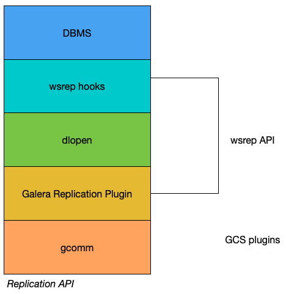

===================
 Replication API
===================
.. _`replication-api`:

Synchronous replication systems generally use eager replication.  Nodes in a cluster will synchronize with all of the other nodes by updating the replicas through a single transaction.  This means that when a transaction commits, all of the nodes will have the same value.  This process takes place using *write-set* replication through group communication.

   *Replication API*

The internal architecture of Galera Cluster revolves around four components:

- **Database Management System (DBMS):**  The database server that runs on an individual node.  Galera Cluster can use MySQL, MariaDB or Percona XtraDB.

- **wsrep API:**  This is the interface to the database server and it's the replication provider.  It consists of two main elements:

 - *wsrep Hooks:* This integrates with the database server engine for write-set replication.

 - *dlopen():* This function makes the wsrep provider available to the wsrep hooks.

- **Galera Replication Plugin:** This plugin enables write-set replication service functionality.

- **Group Communication Plugins:** There several group communication systems available to Galera Cluster (e.g., *gcomm* and `Spread <http://www.spread.org/>`_).

---------------
 wsrep API
---------------
.. _`wsrep-api`:

.. index::
   pair: Global Transaction ID; Descriptions
.. index::
   pair: wsrep API; Descriptions

The :term:`wsrep API` is a generic replication plugin interface for databases.  It defines a set of application callbacks and replication plugin calls.

The wsrep API uses a replication model that considers the database server to have a state.  That state refers to the contents of the database.  When a database is in use and clients modify the database content, its state is changed.  The wsrep API represents changes in the database state as a series of atomic changes, or transactions.

In a database cluster, all of the nodes always have the same state.  They synchronize with each other by replicating and applying state changes in the same serial order.

From a more technical perspective, Galera Cluster handles state changes in the following way:

1. On one node in the cluster, a state change occurs in the database.

2. In the database, the wsrep hooks translate the changes to the write-set.

3. ``dlopen()`` then makes the wsrep provider functions available to the wsrep hooks.

4. The Galera Replication plugin handles write-set certification and replication to the cluster.

For each node in the cluster, the application process occurs by high-priority transactions.

^^^^^^^^^^^^^^^^^^^^^^^^^^^^^^^^^^^^^
Global Transaction ID
^^^^^^^^^^^^^^^^^^^^^^^^^^^^^^^^^^^^^

In order to keep the state identical across the cluster, the wsrep API uses a :term:`Global Transaction ID`, or GTID.  This allows it to identify state changes and to identify the current state in relation to the last state change. Below is an example of a GTID:

.. code-block:: text

    45eec521-2f34-11e0-0800-2a36050b826b:94530586304

The Global Transaction ID consists of the following components:

- **State UUID** This is a unique identifier for the state and the sequence of changes it undergoes.

- **Ordinal Sequence Number:** The seqno is a 64-bit signed integer used to denote the position of the change in the sequence.

The Global Transaction ID allows you to compare the application state and establish the order of state changes.  You can use it to determine whether or not a change was applied and whether the change is applicable to a given state.

---------------------------
 Galera Replication Plugin
---------------------------
.. _`galera-replication-plugin`:

The :term:`Galera Replication Plugin` implements the :term:`wsrep API`.  It operates as the wsrep Provider. From a more technical perspective, the Galera Replication Plugin consists of the following components:

- **Certification Layer:** This layer prepares the write-sets and performs the certification checks on them, ensuring that they can be applied.

- **Replication Layer:** This layer manages the replication protocol and provides the total ordering capability.

- **Group Communication Framework:** This layer provides a plugin architecture for the various group communication systems that connect to Galera Cluster.

------------------------------
 Group Communication Plugins
------------------------------
.. _`group-communication-plugins`:
.. index::
   pair: Virtual Synchrony; Descriptions

The Group Communication Framework provides a plugin architecture for the various gcomm systems.

Galera Cluster is built on top of a proprietary group communication system layer, which implements a virtual synchrony :abbr:`QoS (Quality of Service)`.  Virtual synchrony unifies the data delivery and cluster membership services, providing clear formalism for message delivery semantics.

While virtual synchrony guarantees consistency, it does not guarantee temporal synchrony, which is necessary for smooth multi-master operations.  To address this, Galera Cluster implements its own runtime-configurable temporal flow control.  Flow control keeps nodes synchronized to a fraction of a second.

Group Communication Framework also provides a total ordering of messages from multiple sources.  It uses this to generate :term:`Global Transaction ID`'s in a multi-master cluster.

At the transport level, Galera Cluster is a symmetric undirected graph.  All database nodes connect to each other over a :abbr:`TCP (Transmission Control Protocl)` connection.  By default, :abbr:`TCP (Transmission Control Protocl)` is used for both message replication and the cluster membership services. However, you can also use :abbr:`UDP (User Datagram Protocol)` multicast for replication in a :abbr:`LAN (Local Area Network)`.

.. |---|   unicode:: U+2014 .. EM DASH
   :trim:
