.. meta::
   :title: Deploying a Cluster in Galera Manager
   :description:
   :language: en-US
   :keywords: galera cluster, gmd, galera manager, gui
   :copyright: Codership Oy, 2014 - 2020. All Rights Reserved.

.. container:: left-margin

   .. container:: left-margin-top

      :doc:`The Library <../index>`

   .. container:: left-margin-content

      .. cssclass:: here

         - :doc:`Documentation <./index>`

      - :doc:`Knowledge Base <../kb/index>`
      - :doc:`Training <../training/index>`

      .. cssclass:: sub-links

         - :doc:`Tutorial Articles <../training/tutorials/index>`
         - :doc:`Training Videos <../training/videos/index>`

      - :doc:`FAQ <../faq>`

      Galera Manager Documents

      - :doc:`Getting Started <./galera-manager>`
      - :doc:`Installing <./gmd-install>`
      - :doc:`AWS Ports <./galera-manager-ports>`
      - :doc:`gmd Daemon <./gmd>`

      .. cssclass:: here

         - :doc:`Deploying Clusters <./galera-manager-adding-clusters>`

      - :doc:`Adding Nodes <./galera-manager-adding-nodes>`
      - :doc:`Adding Users <./galera-manager-adding-users>`
      - :doc:`Loading Data <./galera-manager-initializing-data>`
      - :doc:`Monitoring a Cluster <./galera-manager-monitoring-clusters>`
      - :doc:`Upgrading <./gmd-upgrading>`

.. container:: top-links

   - `Home <https://galeracluster.com>`_

   .. cssclass:: here

      - :doc:`Docs <./index>`

   - :doc:`KB <../kb/index>`

   .. cssclass:: nav-wider

      - :doc:`Training <../training/index>`

   - :doc:`FAQ <../faq>`

.. cssclass:: library-document
.. _`galera-manager-cluster-deployment`:

===================================================
Deploying a Cluster in Galera Manager
===================================================

With Galera Manager installed on your server or an *AWS Instance*, you're ready to deploy a Galera Cluster. This page of the Codership documentation describes how to connect to Galera Manager, create a cluster and how to add nodes to a cluster. If you haven't already installed Galera Manager, go to the :doc:`gmd-install` documentation page to do that first.

Without Galera Manager, to create a Galera Cluster, you have to set up multiple servers or AWS Instances, and then install MySQL or MariaDB and Galera software on each.  You also have to configure each server or node.  It's a fairly detailed process.  Instead, you can use the Galera Manager to make the process of creating a cluster and adding nodes simple and quick.

.. _`galera-manager-new-clusters`:
.. rst-class:: section-heading
.. rubric:: Create a Cluster

To create a cluster in Galera Manager, click on *Create New Cluster*.  You'll then see a large dialog box like the one below in Figure 1. In this box you will give the cluster a name, as well as make some default choices for creating nodes and hosts

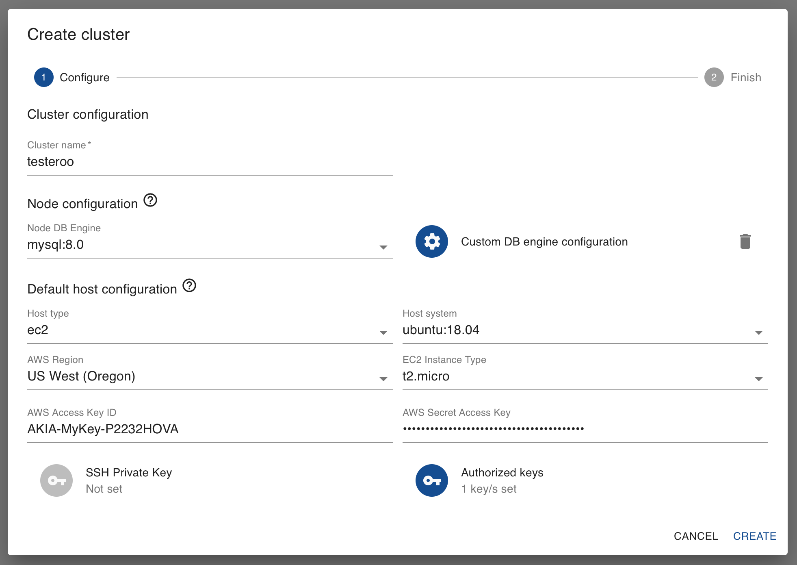

   Create Cluster Dialog Box (Figure 1)

Looking at the screenshot here, in the first section labeled *Cluster Configuration*, you can see that you have to provide a name for your cluster. In this example, the name *testeroo* was given, but you should enter something more meaningful to your organization or system |---| especially if you will be creating more than one cluster.

That's all there is, per se, to the cluster configuration. A Galera Cluster is an association of nodes working together as equals, with all of the settings on the nodes. So the rest of the questions are related to the node and host levels.  The choices available for them are described in the next section.

Before proceeding, it's worth taking a moment to be clear as to the difference between a node and a host in a Galera Cluster. A node is essentially the MySQL or MariaDB server (i.e., the ``mysqld`` daemon) interacting with the other nodes to replicate data changes among them. The host is the physical or virtual computer upon which the node is running.  This is why you will only see the names of hosts in the list of *Instances* on the AWS console, and only the names of nodes in the Galera and database logs. Galera Manager's role is to facilitate the creating of *AWS Instances* for hosts, the assembling of nodes for a cluster, the installation of all of the needed software, and to track metrics in the cluster.  Basically, it does much of the mundane work usually performed by an administrator and makes monitoring clusters easier.

.. _`galera-manager-node-configuration`:
.. rst-class:: section-heading
.. rubric:: Default Node Configuration

In the next section of the box shown in Figure 1, the section labeled *Node Configuration*, you're asked to make default choices that will be used when you later add nodes to the cluster.  To be clear as to what's discussed, below is the screenshot from Figure 1, but cropped around the default node configuration section:

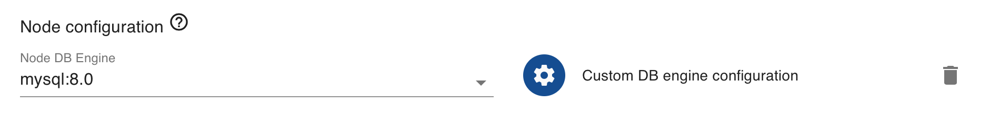

   Host Defaults Section of Create Cluster Dialog Box (Figure 2)

The first field in this section asks you to specify whether you want to use MySQL or MariaDB, and the version of which one you choose. You're asked to set the default database system for your nodes of the cluster because the nodes should all use the same version of the same database system.  You shouldn't have one node in a cluster using MySQL and another MariaDB, or even have them all using MySQL, but different versions. If you create another cluster, however, it may use a different database system and version.

.. _`galera-manager-default-node-db-configuration`:
.. rst-class:: sub-heading
.. rubric:: Database Engine Configuration

Next, to the right in Figure 2, you may provide some special settings for MySQL or Galera, extra entries you want to make to the configuration files on all of the node.  You would click on the icon of a cogwheel, where is says *Custom DB Engine Configuration*, to add those options or variable names with the values you want. Before doing this, though, you should be aware of what will be set by default by Galera Manager.

In Example 1 below is the contents of ``/etc/mysql/mysql.conf.d/mysqld.cnf`` on one of the nodes which is running Ubuntu |---| it's the same for each node:

.. code-block:: ini
   :caption: MySQL Daemon Configuration File (Example 1)
   :name: mysqld.cnf File Contents

   [mysqld]
   pid-file	= /var/run/mysqld/mysqld.pid
   socket = /var/run/mysqld/mysqld.sock
   datadir = /var/lib/mysql
   log-error = /var/log/mysql/error.log

These are minimal settings for MySQL.  For Galera Cluster, there is an additional configuration file. These are the settings in ``/etc/mysql/wsrep/conf.d/00.galera.cnf``, for the same node running Ubuntu:

.. code-block:: ini
   :caption: Galera Configuration File (Example 2)
   :name: galera.cnf File Contents
   :emphasize-lines: 4, 6, 7, 8

   [mysqld]
   bind-address = 0.0.0.0
   wsrep_on = ON
   # make it dynamic according to the distribution
   wsrep_provider = /usr/lib/galera/libgalera_smm.so
   wsrep_cluster_address = 'gcomm://52.25.88.43,54.213.111.232,35.163.3.151'
   wsrep_cluster_name = 'testeroo'
   wsrep_node_name = 'noder-jfebk'
   wsrep_sst_method = rsync
   binlog_format = row
   default_storage_engine = InnoDB
   innodb_autoinc_lock_mode = 2
   log_error = /var/log/mysql/error.log
   general_log_file = /var/log//mysql/general.log
   general_log = 1
   slow_query_log_file = /var/log/mysql/mysql-slow.log
   slow_query_log = 1

Although these excerpts were taken from Ubuntu nodes, the same settings will be found in nodes using other Linux distributions generated by Galera Manager. Notice that two lines were set for this particular cluster: ``wsrep_cluster_address`` contains all of the IP addresses of the nodes; and ``wsrep_cluster_name`` contains the name of the cluster.  There's one line that is set for this particular node: ``wsrep_node_name`` contains the node's name.  These adjustments are made by Galera Manager when adding nodes.

Again, if you want to add some other settings, perhaps setting values for InnoDB buffers, you add them to the box for *Custom DB Engine Configuration*. Below in Figure 3 is a screenshot of that box and how you might enter values:

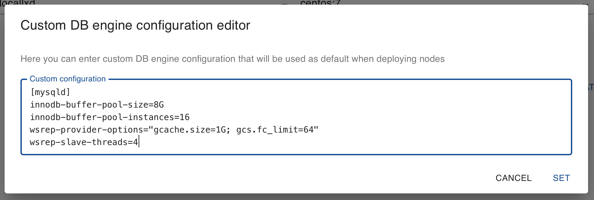

   Node Default Database Custom Configuration (Figure 3)

Notice that you have to include the ``[mysqld]`` heading. When you're finished, click on *Set* to save.  At this time, you won't be able to make changes to these settings once you finish creating the cluster. So be sure you have everything you want before clicking *Create*.  Otherwise, you'll have to log into each node to make changes manually to the configuration files. In a future release, you will be able to edit these default settings from within Galera Manager.

.. _`galera-manager-default-host-configuration`:
.. rst-class:: section-heading
.. rubric:: Default Host Configuration

The next section of the *Create Cluster* dialog box relates to how you want to create hosts, the servers on which nodes will be running. This has to do primarily with the operating system to install on the servers and how you will access those servers using ``ssh``.

To make it easier to discuss, below is the screenshot from Figure 1, but this time cropped around the default host configuration section:

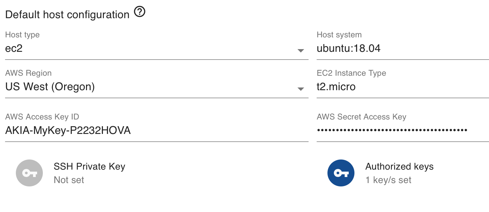

   Host Defaults Section of Create Cluster Dialog Box (Figure 4)

The first field allows you to chose the host type: *locallxd* or *ec2*. Choosing *locallxd* will instruct Galera Manager to generate Linux Containers, using the ``lxd`` daemon, to create hosts when you add nodes later.  They'll all run on the same server where you have Galera Manager.  This option is primarily for testing purposes and shouldn't generally be used.

Choosing *ec2* will use Amazon's EC2 service to create separate *AWS Instances* for each host needed for each node you add to the cluster. When you choose this, there will be fields allowing you to choose which AWS region to use for hosts, and which type of *Instance* |---| these relate to the size and speed of the server.

.. _`galera-manager-default-host-aws-keys`:
.. rst-class:: sub-heading
.. rubric:: AWS Access Keys

You will also be asked to provide your *Access Key* information so that Galera Manager may interface with AWS on your behalf. This information is secure and not shared with Codership: it's confined to your installation of Galera Manager. Even if you already have a copy of the ID and the password, you may want create another key for use only by Galera Manager. You would do this on AWS's site. To get to this page, log into the EC2 console. Then click where the name for your account is show. A pull-down menu will appear, as you see in the screenshot below:

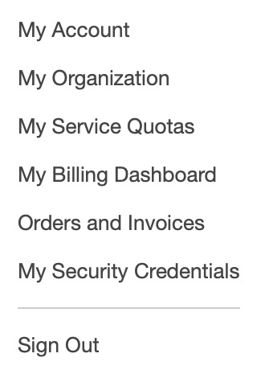

   AWS Account Menu (Figure 5)

Click where it says, *My Security Credentials*.  This will take you to the *Identity and Access Management (IAM)* page.  Look in the main panel for the choice labeled, *Access Keys* and click on it to expand that sub-section.  Your screen will look something like the screenshot below:

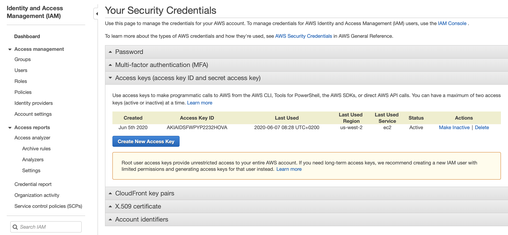

   AWS Security Credentials (Figure 6)

Then just click on the blue button labeled, *Create New Access Key*.  It will immediately create a new *AWS Access Key ID* and *AWS Access Key*.  You'll see a box appear like the one in the screenshot below:

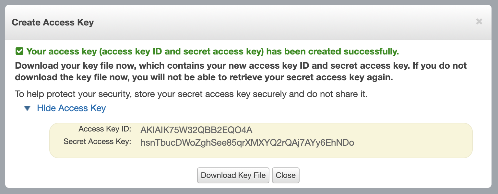

   Created AWS Access Key (Figure 7)

You can copy the text containing the *AWS Access Key ID* and the *AWS Access Key* (see Figure 7), and paste each of them into the appropriate fields in Galera Manager where you're in the process of creating a cluster, in the *Default Host Configuration* section.  You may also want to click on the gray button that reads, *Download Key File* to download the *AWS Access Key*.  This will download a CSV file containing the same information.  Make a copy or download the key immediately and save it to a secure location since you won't be able to access this key on AWS or in Galera Manager once you close this box.

.. _`galera-manager-default-host-ssh-keys`:
.. rst-class:: sub-heading
.. rubric:: SSH Keys

The last two fields of the *Default Host Configuration* section are related to ``ssh`` enryption keys. To be clear, below is the screenshot from Figure 1 again, but cropped here around the part on SSH keys:

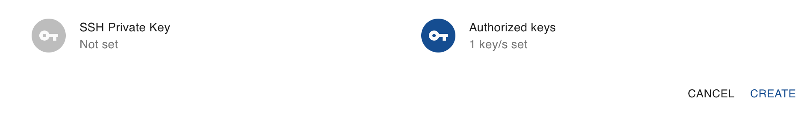

   SSH Keys for Default Host Configuration (Figure 8)

These encryption keys are used to access the AWS Instances, the hosts that are generated by AWS using ``ssh``.  Without them, you can't log into the server and make changes at the command-line.

The private key is entered in a box that appears when you click on *SSH Private Key*. It's saved by AWS and attached to the host in its system.  With it, Galera Manager will generate a public key for it to be able to access the host. You can enter your own private key, but its not necessary. AWS will generate one for you behind-the-scenes. You won't be able to download it through Galera Manager or on AWS.  So you may as well let AWS handle that part.

For you as administrator to access the host with ``ssh``, you will need to provide a public key that matches the format of the private key. Click on the icon of a key on the right, where it says, *Authorized Keys*.  A box will appear like the one below in Figure 9 for you to paste in your public key from your own private key:

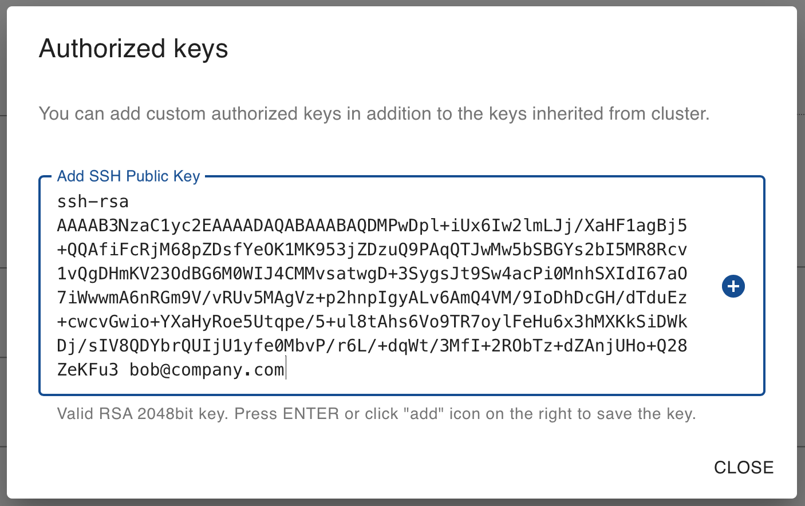

   Add Authorized Public SSH Keys (Figure 9)

After pasting in the public key, click on the plus-sign icon to store it.  The field will become empty again so that you may paste in another public key. You may want to paste in a public key for each person for whom you want to provide command-line access. Incidentally, if the public key includes the user's email address, this will be included in the list of users (see Figure 10 below).

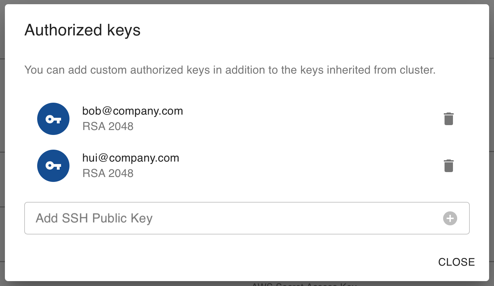

   Authorized Public SSH Keys (Figure 10)

.. _`galera-manager-cluster-deployed`:
.. rst-class:: section-heading
.. rubric:: Finishing Deployment

When you finish with all of your settings for the new cluster, click on the text in blue where it reads, *Create*.  This will open a small box that should say it was successful, like the one below:

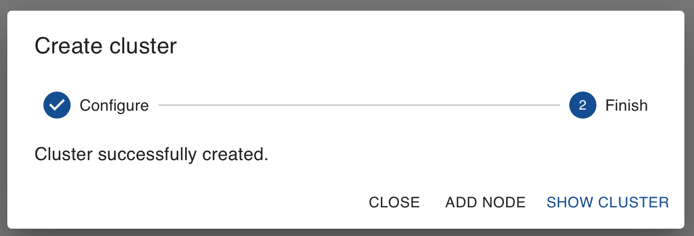

   Cluster Finished Creating (Figure 11)

There's not much to this because you haven't yet added nodes to the cluster.  To learn about how to add nodes to a cluster, read the :doc:`galera-manager-adding-nodes` documentation page. Check the :doc:`galera-manager-adding-users` page on adding users, the :doc:`galera-manager-initializing-data` on adding data, and the :doc:`galera-manager-monitoring-clusters` page on configuring the metrics to track.

.. container:: bottom-links

   Galera Manager Documents

   - :doc:`Getting Started <./galera-manager>`
   - :doc:`Installing <./gmd-install>`
   - :doc:`AWS Ports <./galera-manager-ports>`
   - :doc:`gmd Daemon <./gmd>`
   - :doc:`Deploying Clusters <./galera-manager-adding-clusters>`
   - :doc:`Adding Nodes <./galera-manager-adding-nodes>`
   - :doc:`Adding Users <./galera-manager-adding-users>`
   - :doc:`Loading Data <./galera-manager-initializing-data>`
   - :doc:`Monitoring a Cluster <./galera-manager-monitoring-clusters>`
   - :doc:`Upgrading <./gmd-upgrading>`

.. |---|   unicode:: U+2014 .. EM DASH
   :trim:
