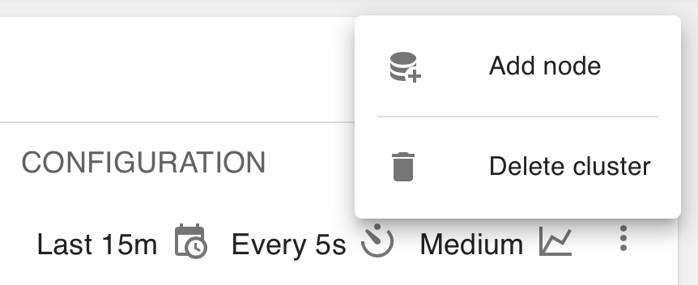
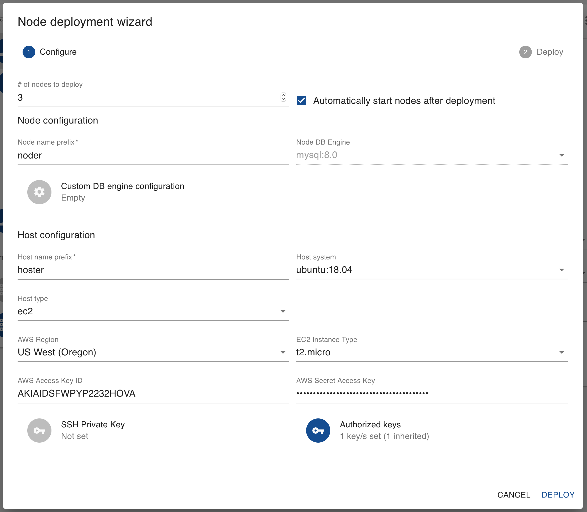
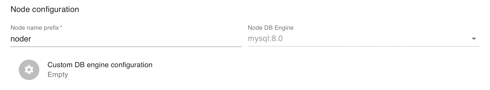
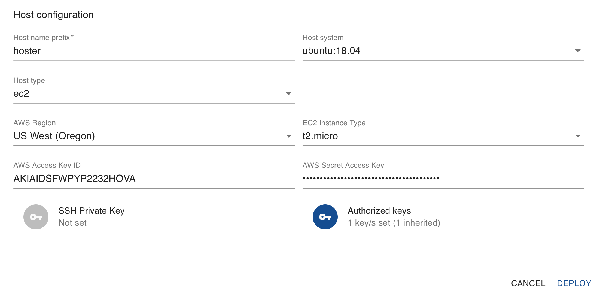
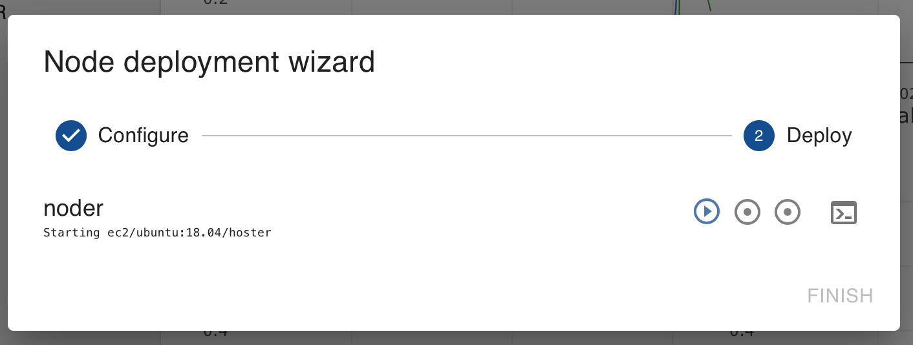
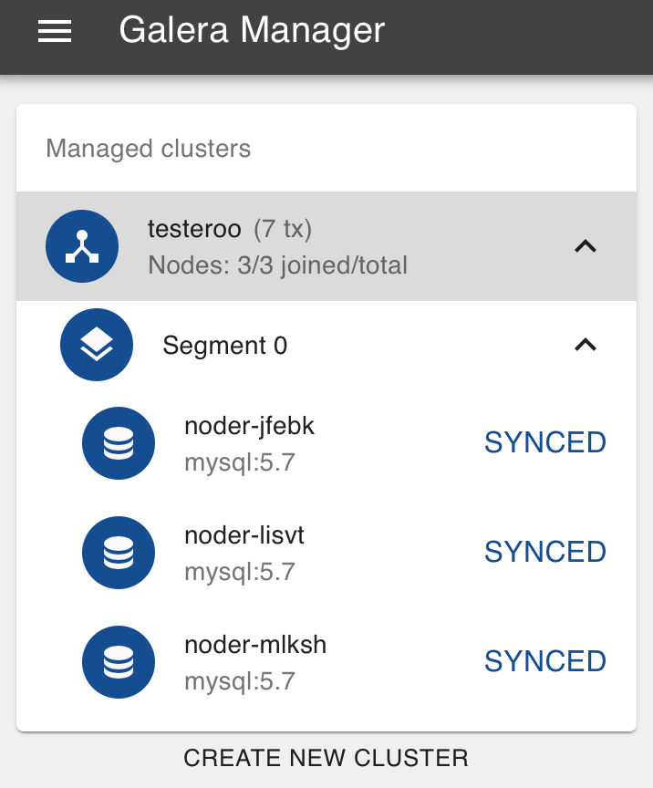
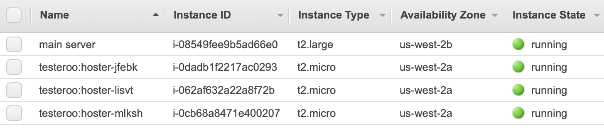

.. meta::
   :title: Adding Nodes with Galera Manager
   :description:
   :language: en-US
   :keywords: galera cluster, gmd, galera manager, gui
   :copyright: Codership Oy, 2014 - 2020. All Rights Reserved.

.. container:: left-margin

   .. container:: left-margin-top

      :doc:`The Library <../index>`

   .. container:: left-margin-content

      .. cssclass:: here

         - :doc:`Documentation <./index>`

      - :doc:`Knowledge Base <../kb/index>`
      - :doc:`Training <../training/index>`

      .. cssclass:: sub-links

         - :doc:`Tutorial Articles <../training/tutorials/index>`
         - :doc:`Training Videos <../training/videos/index>`

      - :doc:`FAQ <../faq>`

      Galera Manager Documents

      - :doc:`Getting Started <./galera-manager>`
      - :doc:`Installing <./gmd-install>`
      - :doc:`AWS Ports <./galera-manager-ports>`
      - :doc:`gmd Daemon <./gmd>`
      - :doc:`Deploying Clusters <./galera-manager-adding-clusters>`

      .. cssclass:: here

         - :doc:`Adding Nodes <./galera-manager-adding-nodes>`

      - :doc:`Adding Users <./galera-manager-adding-users>`
      - :doc:`Loading Data <./galera-manager-initializing-data>`
      - :doc:`Monitoring a Cluster <./galera-manager-monitoring-clusters>`
      - :doc:`Upgrading <./gmd-upgrading>`

.. container:: top-links

   - `Home <https://galeracluster.com>`_

   .. cssclass:: here

      - :doc:`Docs <./index>`

   - :doc:`KB <../kb/index>`

   .. cssclass:: nav-wider

      - :doc:`Training <../training/index>`

   - :doc:`FAQ <../faq>`

.. cssclass:: library-document
.. _`galera-manager-adding-nodes`:

===================================================
Adding Nodes with Galera Manager
===================================================

After you've created a cluster, set the defaults for nodes within Galera Manager, you'll need to add nodes to that cluster. When  you add nodes to a cluster, Galera Manager will add hosts on AWS (Amazon Web Services) and install all of the software needed, including either MySQL or MariaDB. It will then configure ``mysqld`` to be a node in the cluster.

If you haven't yet created a cluster, read the :doc:`galera-manager-adding-clusters` page |---| installing Galera Manager is covered in the :doc:`gmd-install` page.

.. _`galera-manager-node-deployment`:
.. rst-class:: section-heading
.. rubric:: Node & Host Deployment

To add nodes to a cluster, after logging into Galera Manager from a web browser, click on the cluster in the left margin.  In the main panel, click then on the vertical ellipsis in the top right margin.  When you do, a small box (see Figure 1 below) will offer you two choices:  to add a node or to delete the cluster.  Click on *Add Node*.

   Close-Up of Menu to Change a Cluster (Figure 1)

You may add nodes one at a time, or several at the same time.  Typically, a cluster has at least three nodes.  You may start with three nodes and easily add more later.  Or you could start with more than three and later delete unneeded nodes. This is one of the advantages of Galera Manager:  the ability to expand and contract a cluster, easily.  Keep in mind when you add nodes, though, you're creating *AWS Instances* and Amazon may be charging you based on the number of nodes and other usage factors.

After you click *Add Node*, a large box like the one shown in the screenshot below in Figure 2 will appear.  Here you will provide your preferences for the node or nodes, and the hosts you want to add.

   Node Deployment for a Cluster (Figure 2)

As mentioned above, the first field at the top left of the *Node Deployment Wizard* is to enter the number of nodes you want to add.  In the example here, 3 has been entered.  By default, the nodes will be started automatically after the hosts have been generated and configured.

.. _`galera-manager-node-deployment-choices`:
.. rst-class:: sub-heading
.. rubric:: Node Deployment Choices

Next, you'll enter specific information on this node or set of nodes.  To make discussing easier, below is the screenshot from Figure 2, but cropped around the default node configuration section:

   Node Configuration (Figure 3)

At a minimum, you would enter the prefix for naming nodes.  If you're creating only one node, what you enter here will be used. If you're creating multiple nodes, this text will be used as a prefix to each node's name. The suffix of the node name will be randomly generated.  If it's important to you to name each node, you'll need to add them one at a time to the cluster.

The database system and version is already set from when you created the cluster.  You have to use the same database system for each node. However, although the custom database settings you might have added at that time will be passed to the nodes |---| if you're creating nodes one at a time |---| you may give one node extra settings.  You probably wouldn't do this with the initial set of nodes, but later when you're adding temporarily another node because of a surge in traffic, you might want the extra node to handle more traffic. Therefore, you may want to set its buffers and other settings to higher values.  You can add those settings then for the one node.

.. _`galera-manager-host-deployment-choices`:
.. rst-class:: sub-heading
.. rubric:: Host Deployment Choices

The next part of the *Node Deployment Wizard*, shown in the cropped screenshot below, relates to configuring the hosts.  Remember, hosts are the virtual servers or instances generated by AWS.  You can set all of the values as you did when you created the cluster, although they are by default set to the choices you made then.  These choices are explained in the :ref:`galera-manager-default-host-configuration` section of the :doc:`galera-manager-adding-clusters` documentation page.

   Host Configuration (Figure 4)

Being able to make different choices for the host when adding nodes is particularly useful when adding nodes to an existing and running cluster.  As just mentioned, if you're adding temporarily a node because of an increase in traffic, you might want to use a larger server.  To do this, you would select a different *EC2 Instance Type*, one with more memory and processing power.  If you want to migrate to a new release of Linux, you can add new nodes with that choices. After they've synchronized, you could then delete the old nodes.

.. _`galera-manager-node-host-deployment-finishing`:
.. rst-class:: section-heading
.. rubric:: Finishing Deployment

After you finish entering the number of nodes in the *Node Deployment Wizard*, and the node and host names, as well as any changes you want to make to the default settings, you would then click on *Deploy* in the right-hand corner. A small box, like the one below, will appear in which you can observe the progress of the hosts and nodes being deployed.

   Progress of Adding Nodes (Figure 5)

This box will be visible for a few minutes at most. If the node deployment fails, you'll see in the small red text at which point it failed.  You can also check the *Logs* and *Jobs* tabs for the cluster and node for more information. When the node deployment succeeds, all of the circled-dot and right-arrow play buttons on the right (see Figure 5) will change to check marks and the *Finish* link will become active.  Click on that link to close the box when it's done.

.. _`galera-manager-node-host-deployment-finished`:
.. rst-class:: sub-heading
.. rubric:: Finished Results

When the *Node Deployment Wizard* has finished running and you've closed the related box, you'll see the nodes that were added listed in the left margin, under the name of the cluster.  The results should look similar to the screenshot below in Figure 6 below:

   Left Margin with Results of Adding Three Nodes (Figure 6)

Notice that although a node name of ``noder`` was entered, some extra text was added to make each node name unique (e.g., ``noder-jfebk``).  As mentioned earlier, if you add one node at a time, you can name each and no suffix will be appended.

If you chose to have the nodes started automatically, they should all have a status of *Synced*. If one wasn't started automatically, click on the node in the left margin, and then click on the vertical ellipsis at the top right of the main panel. From the choices you're offered there, click *Start* to start the node.

As mentioned previously, when you add nodes, a host or *Instance* will be generated for each node in AWS.  If you look in your EC2 console showing your *Instances*, you'll see something like the screenshot below:

   AWS Instances: Galera Manager and Three Hosts (Figure 7)

In this example, there's one *Instance*, the main server on which Galera Manager is installed.  There's an *Instance* for each node of the three in the cluster (e.g., ``hoster-jfebk``, etc.). You see the host names because that's the physical or virtual server on which the node and its software is running.

When you click on a node in the left margin of Galera Manager, you'll see charts for monitoring the node's activities.  To start, it will be fairly empty like the screenshot below:

.. figure:: ../images/galera-manager-new-node.png
   :width: 600px
   :alt: New Node in Galera Manager
   :class: document-screenshot

   New Node in Galera Manager (Figure 8)

At this point, the charts are meaningless.  However, as you start to add data, which is covered in :doc:`galera-manager-initializing-data` page of the documentation, you'll start to see some activity. You can learn more about how to use these charts, as well as how to add other charts to track other metrics than these initial few, by reading the :doc:`galera-manager-monitoring-clusters` page. You may also want to add other users to Galera Manager who can monitor and add clusters and nodes. This is covered on the :doc:`galera-manager-adding-users` page.

.. container:: bottom-links

   Galera Manager Documents

   - :doc:`Getting Started <./galera-manager>`
   - :doc:`Installing <./gmd-install>`
   - :doc:`AWS Ports <./galera-manager-ports>`
   - :doc:`gmd Daemon <./gmd>`
   - :doc:`Deploying Clusters <./galera-manager-adding-clusters>`
   - :doc:`Adding Nodes <./galera-manager-adding-nodes>`
   - :doc:`Adding Users <./galera-manager-adding-users>`
   - :doc:`Loading Data <./galera-manager-initializing-data>`
   - :doc:`Monitoring a Cluster <./galera-manager-monitoring-clusters>`
   - :doc:`Upgrading <./gmd-upgrading>`

.. |---|   unicode:: U+2014 .. EM DASH
   :trim:
