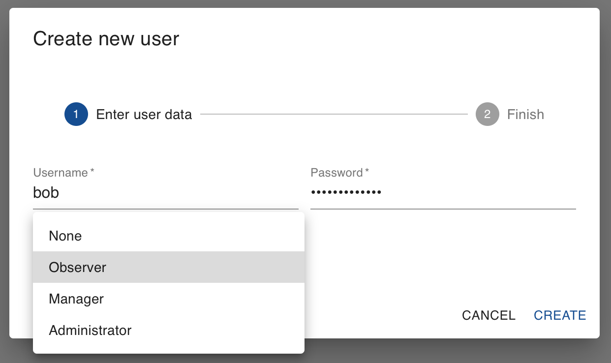
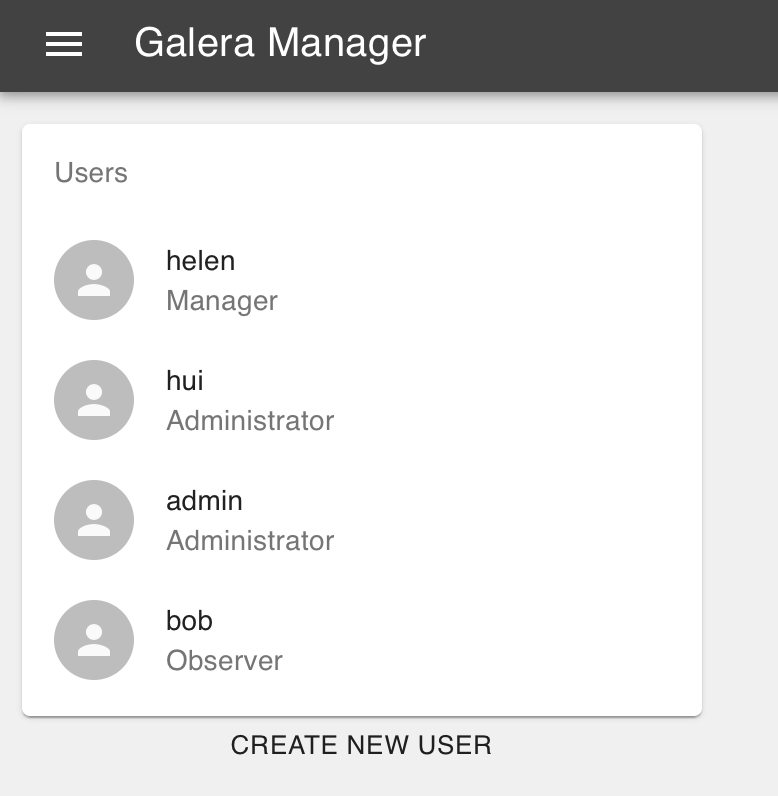
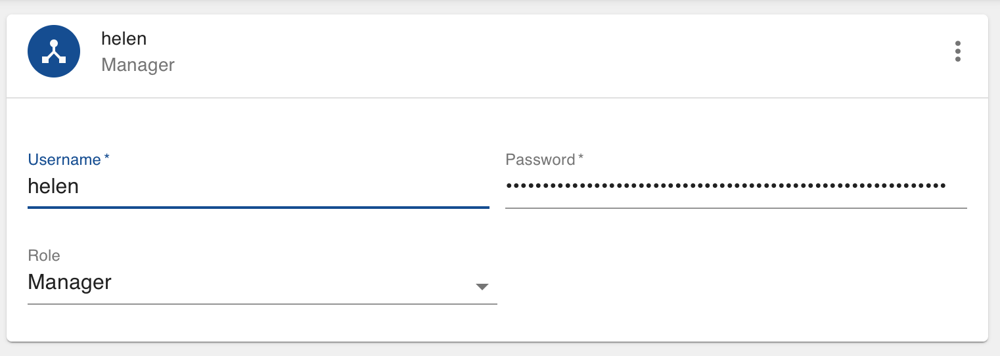

.. meta::
   :title: Adding Users to Galera Manager
   :description:
   :language: en-US
   :keywords: galera cluster, gmd, galera manager, gui
   :copyright: Codership Oy, 2014 - 2020. All Rights Reserved.

.. container:: left-margin

   .. container:: left-margin-top

      :doc:`The Library <../index>`

   .. container:: left-margin-content

      .. cssclass:: here

         - :doc:`Documentation <./index>`

      - :doc:`Knowledge Base <../kb/index>`
      - :doc:`Training <../training/index>`

      .. cssclass:: sub-links

         - :doc:`Tutorial Articles <../training/tutorials/index>`
         - :doc:`Training Videos <../training/videos/index>`

      - :doc:`FAQ <../faq>`

      Galera Manager Documents

      - :doc:`Getting Started <./galera-manager>`
      - :doc:`Installing <./gmd-install>`
      - :doc:`AWS Ports <./galera-manager-ports>`
      - :doc:`gmd Daemon <./gmd>`
      - :doc:`Deploying Clusters <./galera-manager-adding-clusters>`
      - :doc:`Adding Nodes <./galera-manager-adding-nodes>`

      .. cssclass:: here

         - :doc:`Adding Users <./galera-manager-adding-users>`

      - :doc:`Loading Data <./galera-manager-initializing-data>`
      - :doc:`Monitoring a Cluster <./galera-manager-monitoring-clusters>`
      - :doc:`Upgrading <./gmd-upgrading>`

.. container:: top-links

   - `Home <https://galeracluster.com>`_

   .. cssclass:: here

      - :doc:`Docs <./index>`

   - :doc:`KB <../kb/index>`

   .. cssclass:: nav-wider

      - :doc:`Training <../training/index>`

   - :doc:`FAQ <../faq>`

.. cssclass:: library-document
.. _`galera-manager-add-users`:

===================================================
Adding Users to Galera Manager
===================================================

Galera Manager offers several features for the maintenance of Galera Clusters, saving you plenty of time in deploying nodes and similar tasks. However, you may want the assistance of other administrators, especially when you're not around to monitor your clusters.  In anticipation of such situations and needs, you can add other users to the Galera Manager. Note, these are not users for the MySQL or MariaDB databases.

This page of the Codership documentation describes how to add users to Galera Manager. If you haven't already installed Galera Manager, go to the :doc:`galera-manager` documentation page.

.. _`galera-manager-users`:
.. rst-class:: section-heading
.. rubric:: Adding Users

When you installed Galera Manager with the *Installer*, you were asked to specify a user name and password for the administrator.  You were only allowed one user during installation.  Now that Galera Manager is installed, you may add users.  Click on the menu icon, the three horizontal strips at the top left.  It will reveal what you see in the screenshot of Figure 1 below:

.. figure:: ../images/galera-manager-margin-menu.png
   :width: 300px
   :alt: Galera Manager Menu
   :class: document-screenshot

   Galera Manager Menu (Figure 1)

As you can see, there are three choices: *Management*, which brings you back to the primary screen for managing and monitoring Galera Clusters; *Users*, which is where you'll add and remove users for Galera Manager; and *Logout*, which is to log out of Galera Manaager.  If you click on *Users*, you'll see a box similar to the screenshot in Figure 2 below:

   Dialog Box for Adding Users (Figure 2)

In the example in the screenshot above, a user name of *bob* was entered, along with a password. The other choice is to set the user's privileges: *None*, *Observer*, *Manager*, and *Administrator*.  At this time, the only fully implemented user type is Administrator.  However, in soon to be released updates to Galera Manager the other user types will take on meaning.

The setting of *None* will create a user who may log in, but has no access, can see nothing. A user designated as an *Observer* will be allowed to log in and monitor clusters and nodes, but not make any changes. A *Manager* will have all of the privileges of an *Observer*, but will also be allowed to add and delete clusters and nodes, as well as add and remove metrics to monitor.  The *Administrator* can do everything now, including adding and removing users.

.. _`galera-manager-changing-users`:
.. rst-class:: section-heading
.. rubric:: Changing Users

After you've added some users, you'll see them on the user page. To return to this page, click on the menu icon and then *Users*. You'll see a screen like the one in Figure 3 below:

   Galera Manager Users (Figure 3)

You can, of course, add more users. Should you decide to delete a Galera Manager user or to change a user's role, click on that user in the list of users. You'll see in the main panel the same fields you were presented when you created the user, similar to the screenshot below in Figure 4:

   Galera Manager User Information (Figure 4)

Although it would be convenient to be able to change a user's name, password, or role here, it's not yet possible to do so in Galera Manager. In future releases, though, you will be able to change a user's password.  At this time, if you want to change a user's password or their name, you'll have to delete that user and then add them back with the new name or password.

Just click the vertical ellipsis at the top right of the panel for the user. Your only choice there will be to delete the user, so click it. To put the user back, click on the text below the list of users where it says, *Create New User* to add them again with new choices or values.

.. container:: bottom-links

   Galera Manager Documents

   - :doc:`Getting Started <./galera-manager>`
   - :doc:`Installing <./gmd-install>`
   - :doc:`AWS Ports <./galera-manager-ports>`
   - :doc:`gmd Daemon <./gmd>`
   - :doc:`Deploying Clusters <./galera-manager-adding-clusters>`
   - :doc:`Adding Nodes <./galera-manager-adding-nodes>`
   - :doc:`Adding Users <./galera-manager-adding-users>`
   - :doc:`Loading Data <./galera-manager-initializing-data>`
   - :doc:`Monitoring a Cluster <./galera-manager-monitoring-clusters>`
   - :doc:`Upgrading <./gmd-upgrading>`
   
.. |---|   unicode:: U+2014 .. EM DASH
   :trim:
