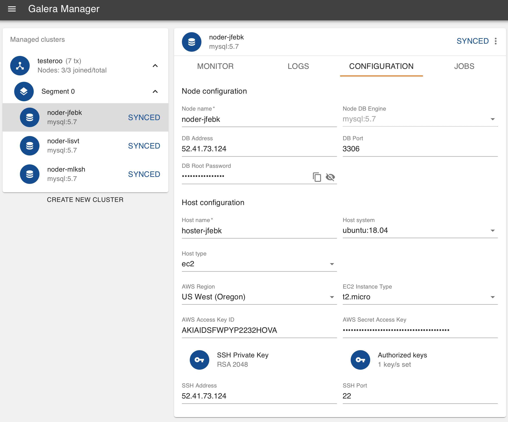
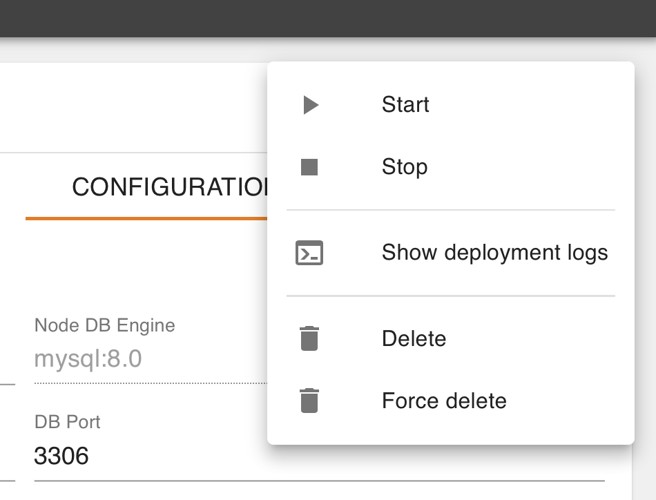

.. meta::
   :title: The Galera Manager - Loading Initial Data
   :description:
   :language: en-US
   :keywords: galera cluster, gmd, galera manager, gui
   :copyright: Codership Oy, 2014 - 2023. All Rights Reserved.

.. container:: left-margin

   .. container:: left-margin-top

      :doc:`The Library <../index>`

   .. container:: left-margin-content

      .. cssclass:: here

         - :doc:`Documentation <./index>`

      - :doc:`Knowledge Base <../kb/index>`
      - :doc:`Training <../training/index>`

      .. cssclass:: sub-links

         - :doc:`Training Courses <../training/courses/index>`
         - :doc:`Tutorial Articles <../training/tutorials/index>`
         - :doc:`Training Videos <../training/videos/index>`

      - :doc:`FAQ <../faq>`
      - :ref:`search`

      Galera Manager Documents

      - :doc:`Getting Started <./galera-manager>`
      - :doc:`Installing <./gmd-install>`
      - :doc:`AWS Ports <./galera-manager-ports>`
      - :doc:`gmd Daemon <./gmd>`
      - :doc:`Deploying Clusters <./galera-manager-adding-clusters>`
      - :doc:`Adding Nodes <./galera-manager-adding-nodes>`
      - :doc:`Adding Users <./galera-manager-adding-users>`

      .. cssclass:: here

         - :doc:`Loading Data <./galera-manager-initializing-data>`

      - :doc:`Monitoring a Cluster <./galera-manager-monitoring-clusters>`
      - :doc:`Upgrading <./gmd-upgrading>`

      Related Articles

      - :doc:`Galera Cluster Backups <../training/tutorials/galera-backup>`
      - :doc:`Migrating to Galera Cluster <../training/tutorials/migration>`
      - :doc:`Upgrading GM <./gmd-upgrading>`

.. container:: top-links

   - `Home <https://galeracluster.com>`_

   .. cssclass:: here

      - :doc:`Docs <./index>`

   - :doc:`KB <../kb/index>`

   .. cssclass:: nav-wider

      - :doc:`Training <../training/index>`

   - :doc:`FAQ <../faq>`

.. cssclass:: library-document
.. _`galera-manager-initial-load-data`:

===================================================
Loading Initial Data
===================================================

After you create a Galera Cluster and add nodes with Galera Manager, you'll probably want to load data from a previous database, to migrate data from another server or cluster.  This is not a feature of Galera Manager since its main focus is the logistics and monitoring of clusters and nodes, not the data contained in the databases.

To load the initial data in a new Galera Cluster created within Galera Manager, you'll have to use standard methods, of which there are a few.  This page of the Codership documentation explains how to log into one of the hosts, and how to use common, basic methods to load data into a node.

If you're unfamiliar with how to make a back-up on an existing Galera Cluster, you could read the :doc:`Backup Cluster Data <./backup-cluster>` documentation page first. There are also links in the margin to tutorials on making back-ups and loading back-ups to a node of a new cluster |---| regardless of whether Galera Manager was used to create the cluster.

.. _`galera-manager-loading-data-methods`:
.. rst-class:: section-heading
.. rubric:: Methods to Load Initial Data

There are two common methods of loading data into MySQL or MariaDB: restoring from a logical or a physical back-up.

.. _`galera-manager-loading-logical`:
.. rst-class:: sub-heading
.. rubric:: Loading Logically

Logical back-ups are generated with a utility like ``mysqldump`` and produce text files (i.e., dump files) or streams containing SQL statements which may be used to rebuild databases. See the tutorial, :doc:`Galera Cluster Backups <../training/tutorials/galera-backup>` for more details on how to use ``mysqldump`` to make a back-up. ``mysqldump`` creates a "dump" file or stream from a source MySQL server which then can be loaded to a new MySQL server using MySQL client utility (``mysql``).

If you will be restoring data by way of a MySQL client, you'll need the node's IP address and the root password for the database. To get this information select a node in Galera Manager and then click on the *Configuration* tab for the node.  You can see an example of this in the screenshot in Figure 1 below:

   Node Configuration (Figure 1)

In the main panel shown here, near the top left of the *Configuration* tab, is the external IP address of the node. It's contained in the *DB Address* field: it's ``52.41.73.124`` in this example. You'll also need the MySQL or MariaDB root password. Incidentally, since it's a new installation of MySQL or MariaDB, there's only the root user.  To get the *DB Root Password* |---| as it's labeled here |---| click on the icon of an eye to reveal it, or click the icon of two sheets of paper to copy the password to your clipboard.

With the node's IP address and the password for root in the database, you can use a MySQL client to load data from a dump file. The example below shows how to restore a dump file made with ``mysqldump``:

.. code-block:: shell
   :caption: Load Data from a ``mysqldump`` File (Example 1)

   mysql -p -u root -h 52.41.73.124 < company-20200607.sql

This line above would be executed on another server where the dump file (i.e., ``company-20200607.sql``) is located.  The host address here is for the node into which it will be loading the data.  When it asks for the password, you would give it the one you copied from the node in Galera Manager.

The dump file contains SQL statements that will execute ``CREATE DATABASE`` and ``CREATE TABLE`` statements, as well as plenty of ``INSERT`` statements to recreate the databases, tables, and rows of data on the new node |---| in the new Galera Cluster. It will run for quite a while, but when it's finished, you might execute an SQL statement like the following from the command-line:

.. code-block:: mysql
   :caption: Checking Loaded Data (Example 2)

   mysql -p -u root -h 52.41.73.124 -e "SHOW TABLES FROM company"

   +----------------------+
   | Tables_in_company    |
   +----------------------+
   | clients              |
   | clients_addresses    |
   | clients_email        |
   | clients_telephones   |
   | employees            |
   | employees_email      |
   | employees_salaries   |
   | employees_telephones |
   | org_departments      |
   | org_divisions        |
   | org_offices          |
   | org_warehouses       |
   | ref_job_titles       |
   | ref_name_titles      |
   | ref_states           |
   +----------------------+

The results table in Example 2 here shows that the ``company`` database was created and so were the tables for it.  You could check further by executing some ``SELECT`` statements to ensure the data was inserted.

You might also go back to Galera Manager to see how the activity looks for your nodes. Below is a screenshot of Galera Manager that was taken shortly after loading the dump file above:

.. figure:: ../images/galera-manager-monitor-data-loading.png
   :width: 600px
   :alt: Galera Manager - Monitoring Data Loading on a Node
   :class: document-screenshot

   Monitoring Data Loading on Nodes (Figure 2)

Notice the first chart at the top left for the cluster has no activity and then there's a spike of activity. There are three line graphs showing spikes because there are three nodes:  one is the data being loaded from the ``mysql`` client and the other two nodes are replicating data that the first node is receiving.

.. _`galera-manager-loading-physical`:
.. rst-class:: sub-heading
.. rubric:: Loading Physcially

The other common method of making back-ups is to use physical back-ups.  This is fairly simple: it's mostly just a copy of MySQL's data directory.  Typically, administrators use ``rsync``, ``xtrabackup`` or ``mariabackup`` to make a back-up copy of the data directory and othere relavent files.  Then they use ``tar`` and ``gzip`` to make a compressed archive file.  See the tutorial, :doc:`Galera Cluster Backups <../training/tutorials/galera-backup>` for more details on this process.

Copying and restoring the data from physical backups is normally much faster than using logical backup, the bigger the volume the bigger the difference. However restoring data from physical backup to Galera Cluster is quite tricky. The problem is that it can't be done on a running node, and as a consequence it goes without cluster being aware of it. The easiest way to initialize Galera cluster from a physical backup is start with a single node cluster and after restoring the node from physical backup, add other nodes at will.

First, create a cluster and add a single node to it. Make sure to supply your public SSH key in the *Authorized Keys* section. You will need your private SSH key counterpart when accessing the host. When the node reaches ``SYNCED`` state, stop the node from Galera Manager: click on the node and then the vertical ellipsis at the top right. This will open a dialog box like the one below:

   Stopping a Node in Galera Manager (Figure 3)

When you click on *Stop*, the node process (``mysqld``) will be stopped, but the host will remain online.

To restore from a physical back-up, you'll need to copy the back-up data to the host frist. This is where you'll need the node's IP address from the node configuration tab mentioned the :ref:`galera-manager-loading-logical` section of this page, and a private SSH key that corresponds to the public key you supplied in the node creation box.

To copy the back-up file to the node, you can use ``scp`` to make a secure copy from the old server where the back-up is located, to the new node. First, you may want to log into the host. You could do that by entering something like the following from the command-line of a local computer:

.. code-block:: shell
   :caption: Logging into a Node to Prepare to Load Data (Example 3)

   ssh -i ~/.ssh/galera-manager root@52.41.73.124

The name of your private key and your node's IP address will be different. Notice it requires you use the user name, root.  That's the only user since this is a new host.

.. code-block:: shell
   :caption: Copying Back-Up Data from Remote Server (Example 4)

   scp -i ~/.ssh/galera-manager /backups/backup-20200607.tgz root@52.41.73.124:/tmp/

This line uses ``scp`` to copy the back-up file from another Ubuntu server to the new node, to the ``/tmp`` directory. Now you can restore MySQL data directory from that backup. Details depend on how you created the backup. Please refer to the documentation on how to use that particular backup method to recover the data directory. In the most trivial case of backup being simply a tarball of the data directory:

.. code-block:: shell
   :caption: Unzipping and Extracting Back-Up Data (Example 5)

   tar -xvzf /tmp/backup-20200607.tgz -C /var/lib/mysql
   chown -R mysql /var/lib/mysql

When you're finished, go back to Galera Manager and start the node.  As soon as ``mysqld`` starts and shows ``SYNCED`` state, you can add more nodes, they will automatically copy data from the first one.  You could execute a few SQL statements on one of the other nodes to see if they have the data, as shown in Example 2.

.. container:: bottom-links

   Galera Manager Documents

   - :doc:`Getting Started <./galera-manager>`
   - :doc:`Installing <./gmd-install>`
   - :doc:`AWS Ports <./galera-manager-ports>`
   - :doc:`gmd Daemon <./gmd>`
   - :doc:`Deploying Clusters <./galera-manager-adding-clusters>`
   - :doc:`Adding Nodes <./galera-manager-adding-nodes>`
   - :doc:`Adding Users <./galera-manager-adding-users>`
   - :doc:`Loading Data <./galera-manager-initializing-data>`
   - :doc:`Monitoring a Cluster <./galera-manager-monitoring-clusters>`
   - :doc:`Upgrading <./gmd-upgrading>`

   Related Articles

   - :doc:`Galera Cluster Backups <../training/tutorials/galera-backup>`
   - :doc:`Migrating to Galera Cluster <../training/tutorials/migration>`
   - :doc:`Upgrading GM <./gmd-upgrading>`

.. |---|   unicode:: U+2014 .. EM DASH
   :trim:
