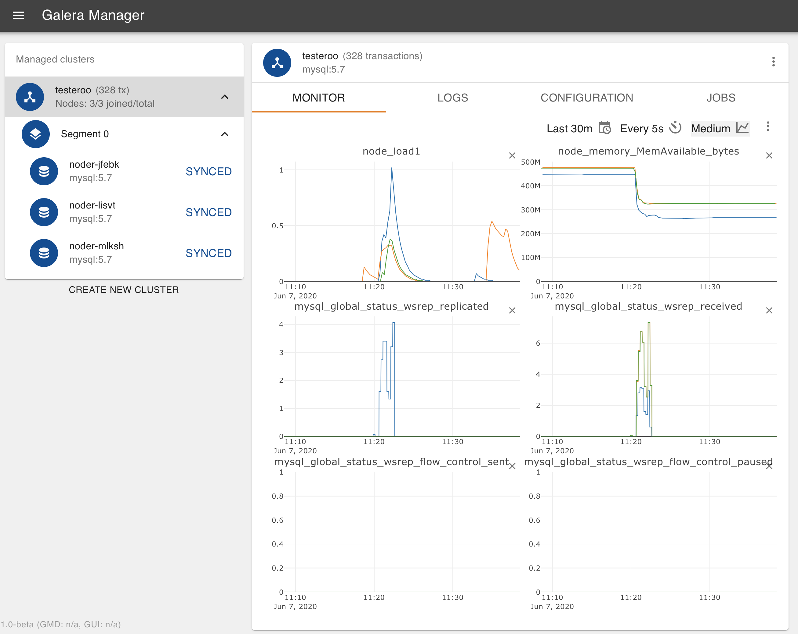
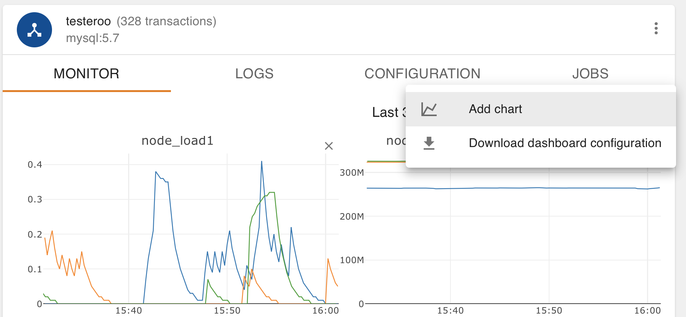
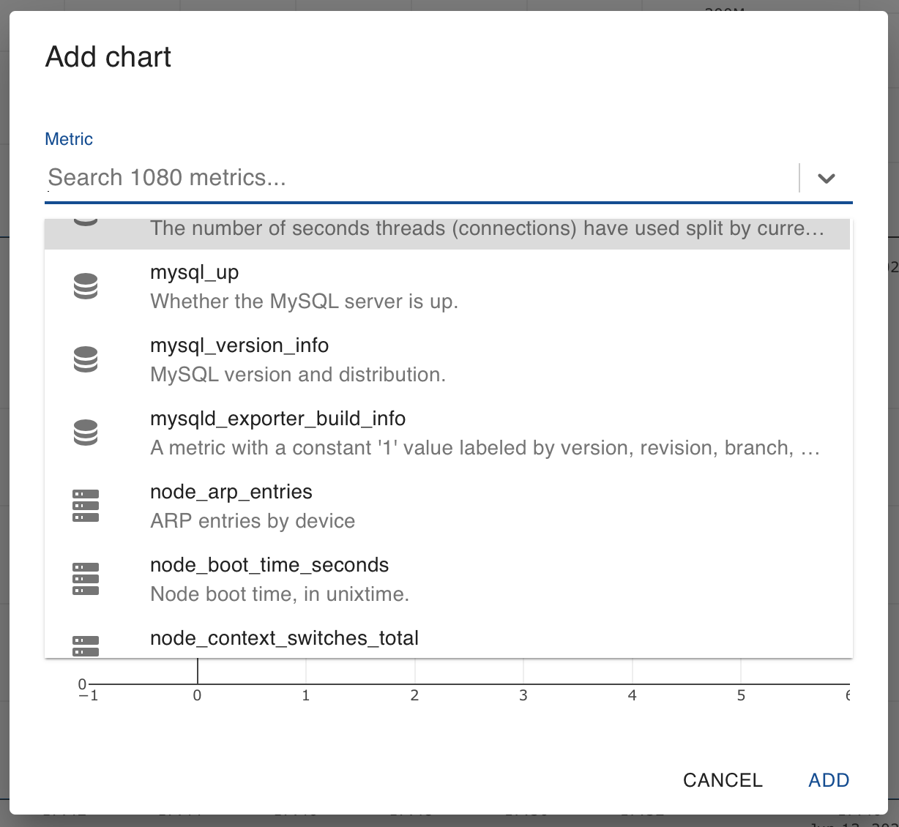
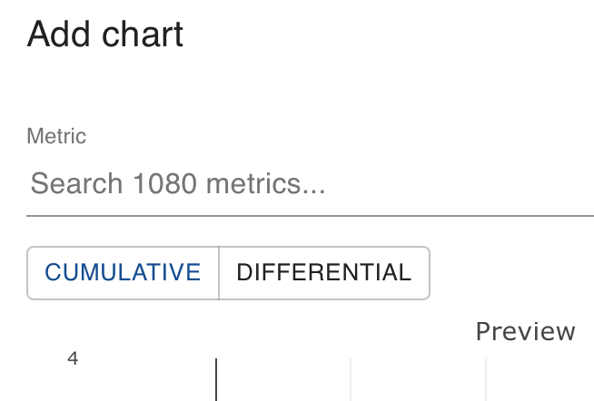
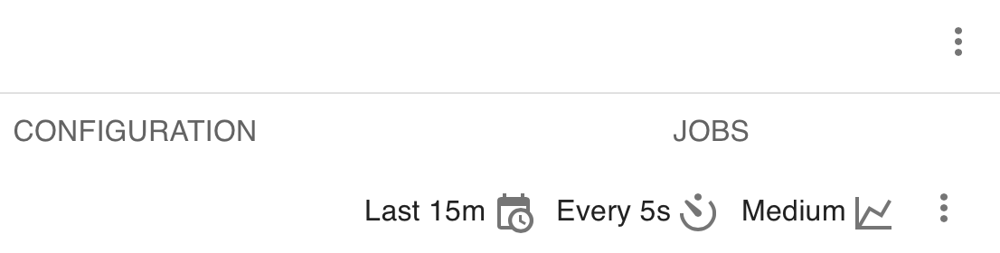
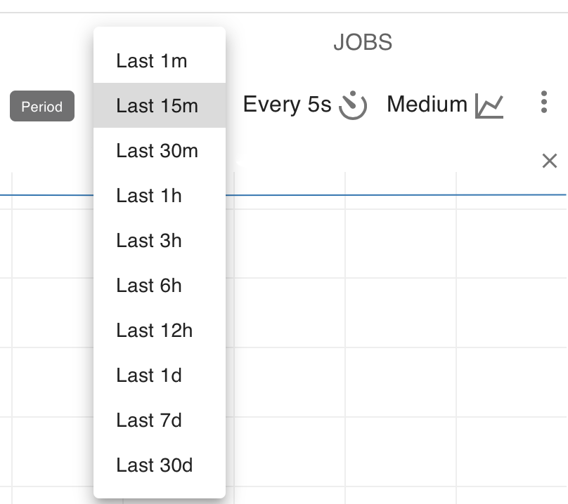
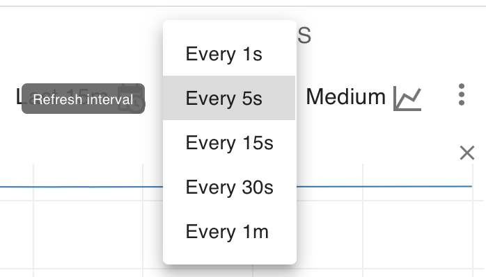
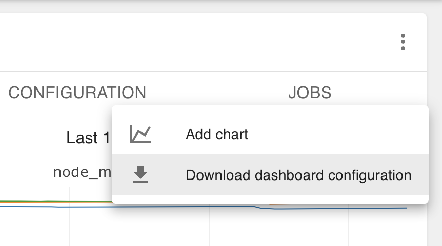

.. meta::
   :title: Monitoring a Cluster with Galera Manager
   :description:
   :language: en-US
   :keywords: galera cluster, gmd, galera manager, gui
   :copyright: Codership Oy, 2014 - 2020. All Rights Reserved.

.. container:: left-margin

   .. container:: left-margin-top

      :doc:`The Library <../index>`

   .. container:: left-margin-content

      .. cssclass:: here

         - :doc:`Documentation <./index>`

      - :doc:`Knowledge Base <../kb/index>`
      - :doc:`Training <../training/index>`

      .. cssclass:: sub-links

         - :doc:`Tutorial Articles <../training/tutorials/index>`
         - :doc:`Training Videos <../training/videos/index>`

      - :doc:`FAQ <../faq>`

      Galera Manager Documents

      - :doc:`Getting Started <./galera-manager>`
      - :doc:`Installing <./gmd-install>`
      - :doc:`AWS Ports <./galera-manager-ports>`
      - :doc:`gmd Daemon <./gmd>`
      - :doc:`Deploying Clusters <./galera-manager-adding-clusters>`
      - :doc:`Adding Nodes <./galera-manager-adding-nodes>`
      - :doc:`Adding Users <./galera-manager-adding-users>`
      - :doc:`Loading Data <./galera-manager-initializing-data>`

      .. cssclass:: here

         - :doc:`Monitoring a Cluster <./galera-manager-monitoring-clusters>`

      - :doc:`Upgrading <./gmd-upgrading>`

.. container:: top-links

   - `Home <https://galeracluster.com>`_

   .. cssclass:: here

      - :doc:`Docs <./index>`

   - :doc:`KB <../kb/index>`

   .. cssclass:: nav-wider

      - :doc:`Training <../training/index>`

   - :doc:`FAQ <../faq>`

.. cssclass:: library-document
.. _`galera-manager-monitoring-clusters`:

===================================================
Monitoring a Cluster with Galera Manager
===================================================

There are perhaps two aspects of Galera Manager that are its best features and make it worthwhile for database administrators to use:  First is the ability to add nodes easily with a graphical interface, and without having to configure each node manually.  Second is the ability to monitor a cluster with a set of charts that can track many database and cluster metrics.

If you happened upon this page of the documentation first, without having installed Galera Manager, please read the :doc:`gmd-install` page and install it. For those who have installed Galera Manager, but have not yet created a cluster with nodes using Galera Manager, read the :doc:`galera-manager-adding-nodes` page.

.. rst-class:: section-heading
.. rubric:: Default Charts & Metrics

After first having created a cluster and added nodes, you'll see a dashboard containing charts for tracking some metrics. Below in Figure 1 is a screenshot of how a cluster with three nodes would look at the start. However, these charts and monitored metrics are just a few that are loaded by default. You can add and remove any charts, monitor any database or cluster metrics you want.

   Monitoring Data Loading (Figure 1)

As a starting point,six charts are configured for new installations.  You may remove any or all of these charts.  Before you do, you might want to consider what these initial ones track:

- **load_node_1** records the CPU load average. It's a standard metric commonly displayed by most load monitors in Linux. Essentially, it tells you how loaded the system is with tasks, tasks competing for CPU usage.
- **node_memory_MemAvailble_bytes** stores how much memory is available for each node.
- **mysql_global_status_wsrep_replicated** indicates the number of write-sets replicated.
- **mysql_global_status_wsrep_received** is the number of write-sets received. Together with the number replicated, this would equal the total transaction rate on the node.
- **mysql_global_status_wsrep_flow_control_sent** provides the number of flow control events emitted by the node.
- **mysql_global_status_wsrep_flow_control_paused** records how much time replication on the node was paused in nano-seconds per second. A value of 1,000,000,000 would mean it was completely paused. This metric and the previous one are very important to troubleshoot replication perfromance concerns.

.. rst-class:: sub-heading
.. rubric:: Metric Names & Associations

There is a pattern to the names of metrics.  Ones containing the word, *node* (e.g., ``load_node_1``), typically come from the Prometheus database system that tracks host status |---| they're not tracking node status since that's basically ``mysqld`` activity; in this context, it's a misnomer.

As for metrics with *mysql_global_status_* as the prefix, the stem is the name of the MySQL or MariaDB global status variable's name. For example, *mysql_global_status_wsrep_replicated* is from the MySQL global status variable, ``wsrep_replicated``.

If for some reason you want to verify a global status variable's value, you can check in a node's database. You would go to the *Configuration* tab for one of the nodes to get the IP address and password for the database system.  Then you would enter something like the following from the command-line of a computer on which the ``mysql`` client is installed:

.. code-block:: console
   :caption: Checking a MySQL Global Status Variable (Example 1)

   mysql -p -u root -h 34.216.245.12 /
      -e "SHOW GLOBAL STATUS LIKE 'wsrep_replicated'"

   +------------------+-------+
   | Variable_name    | Value |
   +------------------+-------+
   | wsrep_replicated | 7     |
   +------------------+-------+

These results should agree with that of the chart in Galera Manager tracking this status variable.  There's no need, though, for you to do this, to enter ``SHOW GLOBAL STATUS`` for every variable you want to monitor:  you now have Galera Manager to do that for you.  If there's a status variables you regularly check, you need only to add a chart in Galera Manager to monitor it.

.. rst-class:: section-heading
.. rubric:: Adding Metrics to Monitor

There are over one-thousand metrics that may be tracked. Some of them measure host operation: CPU usage, free memory, etc. Others come from the node's database engine, the ``mysqld`` process: the number of transactions committed, the amount of dirty pages in the buffer pool and so on.

To add a chart to the monitor in a cluster, click on the cluster in the left margin. Then in the *Monitor* tab, click on the vertical ellipsis at its top right |---| not the vertical ellipsis above it, not the one at the top right of the panel.  See the screenshot in Figure 2 below:

   Adding a Chart (Figure 2)

Click on *Add Chart* and a box will appear like the one in Figure 3 below.  There you will find all of the metrics you may track.  Most are global status variables from MySQL.  There are several at the bottom of the list that come from an external system called Prometheus that stores data on the status of the nodes.  The data is loaded into Prometheus on each node from the ``mysqld_exporter`` daemon running on each host.

.. rst-class:: sub-heading
.. rubric:: Choosing a Metric

In the screenshot below, you can see the dialog box for choosing metrics to chart.  Notice that metrics with the icon of a stack of disks are from MySQL or MariaDB.  Metrics using Prometheus are represented by the icon of a stack of servers.

   Adding a Chart - Looking for a Metric (Figure 3)

You can either scroll through the long list of metrics, or you can enter a variable name in the search line to find it. If you don't remember the precise name of the variable, you may enter part of it (e.g., ``buffer``). This will present entries that match what was entered. You can then click on the one you want.

.. rst-class:: sub-heading
.. rubric:: Cumulative or Differential

Some metrics show the total number of events since the process started (e.g., the number of flow control events sent). As a result, it's value keeps increasing. This sort of metric is called, *Cumulative*. If you choose such a metric, it will be shown on a chart in values per time interval (i.e., per second) over the sampling interval. Other metrics are said to be *Differential* in that they are already in units per second.

Galera Manager is unaware of which metric is cumulative and which is differential. Therefore, you have to mark a chart as such by clicking the appropriate button. It's located in the box for adding a chart as shown in Figure 3 above, but hidden by the list of metrics in that screenshot. Below is the same dialog box, without the list of metrics, and cropped:

   Adding a Chart - Cumulative or Differential (Figure 4)

After you've chosen a metric and indicated whether it's cumulative or differential, click on *Add* at the bottom right corner. You will be taken back to the monitor page and you'll see a chart for the metric you added. You can reposition a chart by clicking on it and holding down the mouse button, then dragging it where you want.

.. rst-class:: section-heading
.. rubric:: Changing a Monitor's Perspective

By default, the last fifteen minutes of the metric is shown in each chart, with the data refreshed every five seconds.  This is meant to show activities that have just happened and happened recently. However, to determine a trend or a pattern, you may want to change the range of time and the refresh rate. You'll notice in the upper right corner of the main panel, above the charts, some selectors (see Figure 5 below). These may be used to change the perspective of a chart.

   Changing Perspectives (Figure 5)

Clicking on the first icon of a calendar with a clock will allow you to change the amount of time displayed in the charts.  You may choose a block of time in minutes (e.g., thirty minutes), or a block in hours (e.g., three hours), or for a period of days (e.g., seven days). You can see the list of choices in the cropped screenshot in Figure 6 below:

   Changing Time Period Displayed (Figure 6)

You may also change the refresh rate to every second, or a less frequent amount of time (e.g., every minute).  You can see a list of choices available in the screenshot shown in Figure 7 below:

   Changing Refresh Rate of Data (Figure 7)

Finally, you can choose the relative size of the charts displayed: small, medium, or large.  This will affect the arrangement of charts across and down.  You might like to keep a separate computer running Galera Manager, continuously. In which case, switching the web browser to full-screen with the charts set to large format would allow you to fill the screen and view the charts from a distance so as to get your attention quickly if a problem arises.

.. rst-class:: section-heading
.. rubric:: Preserving Chart Configuration

You may decide to make use of the default charts provided with Galera Manager, but if you decide to make changes, you may want to download a copy of the dashboard configuration.  You can spend plenty of a time deciding on which metrics to monitor, and how to configure the charts. It would be frustrating to lose your charts configuration.

To preserve the chart configuration, click on the cluster in the left margin. Then in the *Monitor* tab, click on the vertical ellipsis at the top right within that panel. You'll see this pull-down menu, the same one you used to add charts:

   Downloading Dashboard Configuration (Figure 8)

Click on *Download Dashboard Configuration* and Galera Manager will generate a dashboard configuration file and download it, saving it wherever you have set your web browser to download files.  The file will be a json file and named, ``cluster-*name*.json``, where *name* is the name of your cluster (e.g., ``cluster-testeroo.json``).  Below is an excerpt from an example file:

.. code-block:: console
   :caption: Excerpt from an Exported Galera Manager Configuration (Example 2)

   {"name":"cluster-testeroo","config":
     {"charts":
       [{"id":"301186ce-7b7f-41bb-a457-60696aeabba8",
         "name":"mysql_global_status_wsrep_received",
         "metric":"mysql_global_status_wsrep_received",
         "position":3,
         "resolution":"5s",
         "aggregation":"differential"},
      ...
      ...],
   "tileSize":"md","refreshInterval":5000,"period":"15m"}}

This file excerpt has been reformatted with hard-returns and spaces to make it easier to view and follow |---| plus, most of it has been removed and replaced with ellipsis for brevity. But you can get a sense of how the information is stored |---| especially if you're familiar with json file structures.

This is a nice feature, being able to download the configuration file.  However, at this point, the ability to upload a json configuration file is not yet available: Galera Manager is still in its early days.  The configuration settings for a dashboard are stored in Prometheus and there's no easy way to load it. In a future release, though, you should be able to do this from Galera Manager.

.. rst-class:: section-heading
.. rubric:: Resolving Problems & Making Improvements

Galera Manager is an excellent tool for detecting issues early or potential ones with a Galera Cluster |---| hopefully, before they can become a problem. It can also assist in determining when and how performance can be improved before there is a slowing of database traffic or a loss of service.

Should you have problems with Galera Manager, you can check its log files. See the :ref:`gmd-logs` section of the :doc:`gmd` documentation page for information on those logs.

When you encounter a problem with a Galera Cluster, besides reading Codership's :doc:`Documentation <../documentation/index>`, you can look through Codership's :doc:`Knowledge Base <../kb/index>`.  When you can't find a solution on your own, or at least not quickly enough, you can contact `Codership Support & Consulting <https://galeracluster.com/support/>`_.

.. container:: bottom-links

   Galera Manager Documents

   - :doc:`Getting Started <./galera-manager>`
   - :doc:`Installing <./gmd-install>`
   - :doc:`AWS Ports <./galera-manager-ports>`
   - :doc:`gmd Daemon <./gmd>`
   - :doc:`Deploying Clusters <./galera-manager-adding-clusters>`
   - :doc:`Adding Nodes <./galera-manager-adding-nodes>`
   - :doc:`Adding Users <./galera-manager-adding-users>`
   - :doc:`Loading Data <./galera-manager-initializing-data>`
   - :doc:`Monitoring a Cluster <./galera-manager-monitoring-clusters>`
   - :doc:`Upgrading <./gmd-upgrading>`
   

.. |---|   unicode:: U+2014 .. EM DASH
   :trim:
