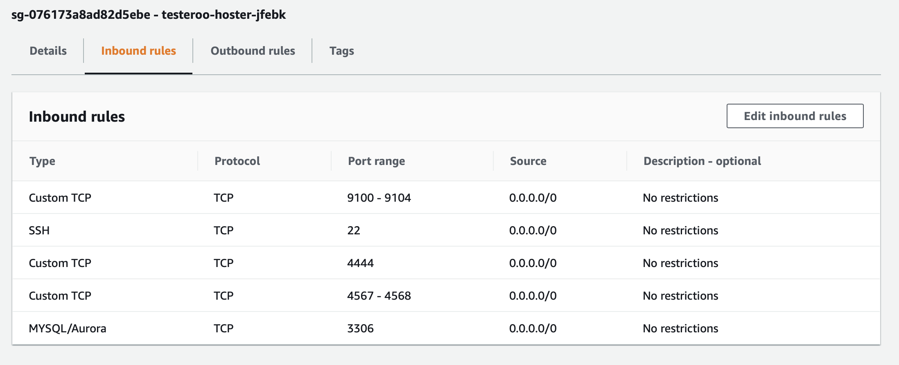
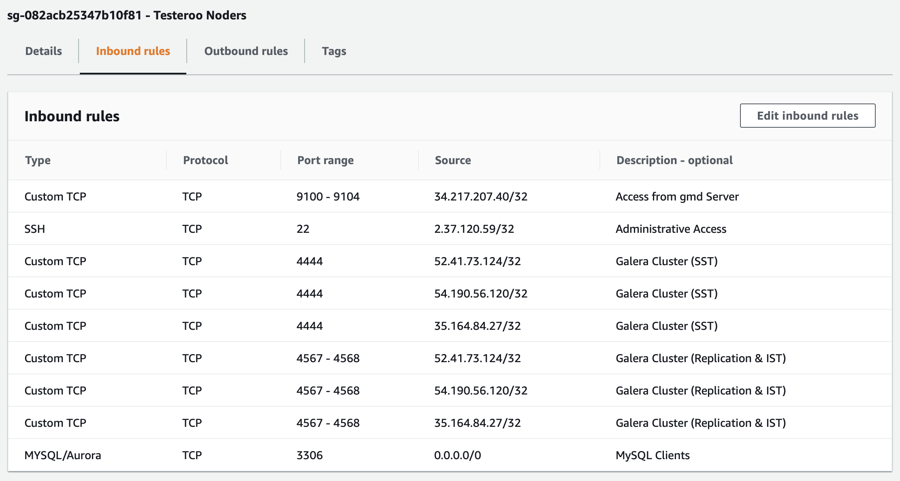

.. meta::
   :title: The Galera Manager - AWS Ports
   :description:
   :language: en-US
   :keywords: galera cluster, gmd, galera manager, gui
   :copyright: Codership Oy, 2014 - 2020. All Rights Reserved.

.. container:: left-margin

   .. container:: left-margin-top

      :doc:`The Library <../index>`

   .. container:: left-margin-content

      .. cssclass:: here

         - :doc:`Documentation <./index>`

      - :doc:`Knowledge Base <../kb/index>`
      - :doc:`Training <../training/index>`

      .. cssclass:: sub-links

         - :doc:`Tutorial Articles <../training/tutorials/index>`
         - :doc:`Training Videos <../training/videos/index>`

      - :doc:`FAQ <../faq>`

      Galera Manager Documents

      - :doc:`Getting Started <./galera-manager>`
      - :doc:`Installing <./gmd-install>`

      .. cssclass:: here

         - :doc:`AWS Ports <./galera-manager-ports>`

      - :doc:`gmd Daemon <./gmd>`
      - :doc:`Deploying Clusters <./galera-manager-adding-clusters>`
      - :doc:`Adding Nodes <./galera-manager-adding-nodes>`
      - :doc:`Adding Users <./galera-manager-adding-users>`
      - :doc:`Loading Data <./galera-manager-initializing-data>`
      - :doc:`Monitoring a Cluster <./galera-manager-monitoring-clusters>`
      - :doc:`Upgrading <./gmd-upgrading>`

.. container:: top-links

   - `Home <https://galeracluster.com>`_

   .. cssclass:: here

      - :doc:`Docs <./index>`

   - :doc:`KB <../kb/index>`

   .. cssclass:: nav-wider

      - :doc:`Training <../training/index>`

   - :doc:`FAQ <../faq>`

.. cssclass:: library-document
.. _`galera-manager-aws-ports`:

===================================================
AWS Ports with Galera Manager
===================================================

There are several ports that Galera Manager uses to communication with the hosts in a cluster, as well as the ports that the nodes in a Galera Cluster use to communicate among themselves |---| and clients use to communicate with MySQL or MariaDB.  There are also ports administrators need to access Galera Manager and the hosts.

You'll have to modify the *Security Group* on AWS (Amazon Web Services) for the *Instance* on which you installed Galera Manager.  In that *Security Group*, you'll have to add *Inbound Rules* for each of the ports that Galera Manager needs.  A *Security Group* will be generated automatically by Galera Manager for each host added to a cluster, but you may want to edit each one, or you may want consolidate those *Security Groups* by creating one for all hosts in the cluster.

Below is information on ports used by Galera Manager, followed by information on the ports used by the hosts. See the :doc:`gmd-install` for more information on installing Galera Manager.

.. _`galera-manager-ports`:
.. rst-class:: section-heading
.. rubric:: Galera Manager Ports

When you successfully completed the installation of Galera Manager using the *Installer*, the final message displayed mentions the TCP ports used by Galera Manager. Below are exceprts from that message, showing the lead-in and the message about ports:

.. code-block:: console
   :caption: Closing Messages from Galera Manager Installer (Example 1)
   :emphasize-lines: 2, 10

   INFO[0213] Galera Manager installation complete.
   Direct your browser to https://34.217.114.37 to use it.
   Since there was no publicly resolvable domain name provided,
   we'll be using self-signed SSL certificate.
   You will be responsible to re-generate it after it expires.
   Also, if the browser warns about security risk when connecting
   to service for the first time, you should choose to "continue".
   ...

   Please make sure you have TCP ports 80, 443, 8091, 8092 open in the server firewall.

As the highlighted line at the bottom here says, you will need to make sure the TCP ports 80, 443, 8091, 8092 are open. This could be on a local computer or on an *AWS Instance* on which you've installed Galera Manager.

Ports 80 and 443 are used to access Galera Manager through a web browser.  Port 8091 is used by ``gmd`` to access InfluxDB for logging, and port 8092 is used by ``gmd`` to access Prometheus for cluster and node metrics, both of which are installed by the *Installer*.

To open these ports on AWS, go to the EC2 console, and click on *Security Groups* in the left margin.  Then look for the *Security Group* for the *Instance* on which you installed Galera Manager. Edit the *Inbound Rules* for that group to open those ports. When you're finished, the *Inbound Rules* will look something like the screenshot below:

.. figure:: ../images/galera-manager-aws-inbound-rules-gmd.png
   :width: 800px
   :alt: AWS Inbound Rules for Galera Manager
   :class: document-screenshot

   AWS Inbound Rules for Galera Manager (Figure 1)

In the example in this screenshot, these ports can be accessed from anywhere. The user will still need the user name and password to access the particular service.  Having these ports accessible like this will allow you, and others you designate, to monitor your cluster from wherever you or they might be. If you don't need this flexibility, you could limit all of these ports to the specific IP addresses from where they would be accessed |---| just as you might normally limit ``ssh`` access for port 22 to the IP address of the administrator who has authority to log into the server.

Incidentally, the *Installer* message shown above is the result of having chosen to enable ``https``.  If you had chosen not to enable it, though, the list of ports to open in AWS will be different:

.. code-block:: console
   :caption: Excerpt from Installer listing Ports to Open (Example 2)
   :emphasize-lines: 2

   ...
   Please make sure you have TCP ports 80, 8081, 8082 open in the server firewall.

Only port 80 is used to access Galera Manager from a web broswer.  Port 8081 is used by ``gmd`` to access InfluxDB; port 8082 is used for Prometheus.  Since you didn't enable ``https``, you'll have to open these three ports in the *Security Group* for the *Instance* on which you've installed Galera Manager. But in this case, you don't need also to enable ports 443, 8091, and 8092.

You may have noticed when looking at the lists of ports above and in Figure 1 that they don't include port 3306 and other ports used by MySQL, MariaDB and Galera Cluster. Galera Manager doesn't need them to create and monitor a cluster and nodes. Those ports are needed on the hosts of the nodes. So separate *Security Groups* will be needed for them.

.. _`galera-manager-node-ports`:
.. rst-class:: section-heading
.. rubric:: Host & Node Ports

After you create a cluster within Galera Manager, and then add nodes to that cluster, Galera Manager will create *Instances* or hosts for each node, and a *Security Group* in AWS with *Inbound Rules* for each host. These rules will open the ports needed for ``gmd`` on the Galera Manager server to communicate with the nodes, as well as the normal ports required by the nodes within a Galera Cluster to communicate with each other, in addition to ports for users and other clients need to communicate with MySQL or MariaDB.

The screenshot in Figure 2 below shows an example of a *Security Group* for a host created with Galera Manager for a node in a cluster:

   AWS Inbound Rules for a Host (Figure 2)

Notice this *Security Group* includes ports 8091 and 8092, which are necessary for Galera Manager to communicate with the host related to host metrics and llogs.  Port 3036 is used by users and clients to communicate with MySQL or MariaDB to access the databases. The other three ports are used by Galera Cluster and the nodes to communicate with each other and synchronize lagging or new nodes that join the cluster.

You might be tempted to tighten security more, to create one *Security Group* to be used by all hosts and in it to specify the IP addresses of each node for ports 4444, 4567, and 4568 |---| perhaps because of the default description, *No Restructions* for each of those rules. Along these lines, you might also change ports 9100 - 9104 to the IP address of wherever Galera Manager or ``gmd`` is running. You would have to leave port 3306 accessible from anywhere, though, so that MySQL users and clients can access the databases.

If you were to do all of that, make all of those changes to the *Source* IP addresses, it would like something like what you see in the screenshot in Figure 3 below:

   *AWS Security Group* for All Hosts (Figure 3)

That looks professional and is in a sense more secure.  However, it takes away from the flexibility of using Galera Manager for adding and removing nodes, if you have to add and delete rules manually for each host, and set the new hosts to this *Security Group*.  Given that the traffic between Galera Manager and the hosts is already very secure already, limiting the IP addresses might be overkill.  Should you decide that you want this extra security and that it's worth the effort, you probably won't have to do it in future releases of Galera Manager since it's on the list of features to add.

For more on the nuances and configuring some of the background settings of Galera Manager, see the :doc:`gmd` page of this documentation.

.. container:: bottom-links

   Galera Manager Documents

   - :doc:`Getting Started <./galera-manager>`
   - :doc:`Installing <./gmd-install>`
   - :doc:`AWS Ports <./galera-manager-ports>`
   - :doc:`gmd Daemon <./gmd>`
   - :doc:`Deploying Clusters <./galera-manager-adding-clusters>`
   - :doc:`Adding Nodes <./galera-manager-adding-nodes>`
   - :doc:`Adding Users <./galera-manager-adding-users>`
   - :doc:`Loading Data <./galera-manager-initializing-data>`
   - :doc:`Monitoring a Cluster <./galera-manager-monitoring-clusters>`
   - :doc:`Upgrading <./gmd-upgrading>`

.. |---|   unicode:: U+2014 .. EM DASH
   :trim:
