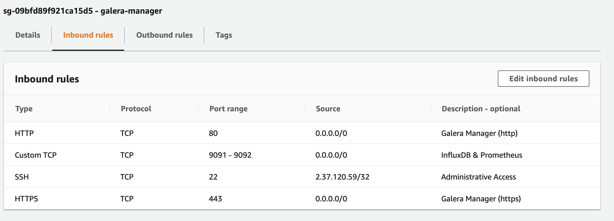
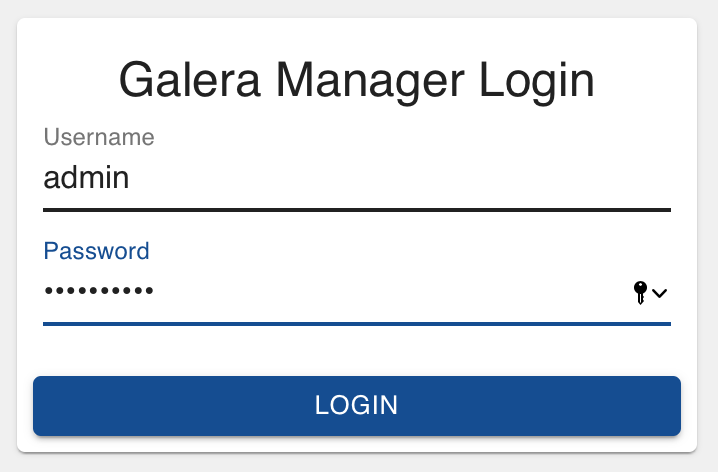
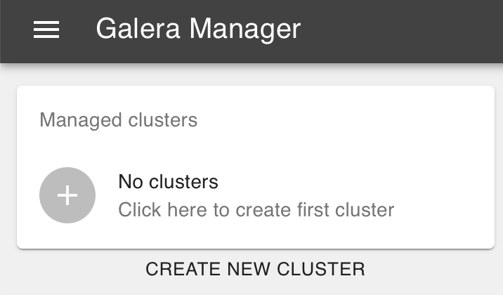

.. meta::
   :title: Installing Galera Manager
   :description:
   :language: en-US
   :keywords: galera cluster, gmd, galera manager, gui, installation, install
   :copyright: Codership Oy, 2014 - 2020. All Rights Reserved.

.. container:: left-margin

   .. container:: left-margin-top

      :doc:`The Library <../index>`

   .. container:: left-margin-content

      .. cssclass:: here

         - :doc:`Documentation <./index>`

      - :doc:`Knowledge Base <../kb/index>`
      - :doc:`Training <../training/index>`

      .. cssclass:: sub-links

         - :doc:`Tutorial Articles <../training/tutorials/index>`
         - :doc:`Training Videos <../training/videos/index>`

      - :doc:`FAQ <../faq>`

      Galera Manager Documents

      - :doc:`Getting Started <./galera-manager>`

      .. cssclass:: here

         - :doc:`Installing <./gmd-install>`

      - :doc:`AWS Ports <./galera-manager-ports>`
      - :doc:`gmd Daemon <./gmd>`
      - :doc:`Deploying Clusters <./galera-manager-adding-clusters>`
      - :doc:`Adding Nodes <./galera-manager-adding-nodes>`
      - :doc:`Adding Users <./galera-manager-adding-users>`
      - :doc:`Loading Data <./galera-manager-initializing-data>`
      - :doc:`Monitoring a Cluster <./galera-manager-monitoring-clusters>`
      - :doc:`Upgrading <./gmd-upgrading>`

.. container:: top-links

   - `Home <https://galeracluster.com>`_

   .. cssclass:: here

      - :doc:`Docs <./index>`

   - :doc:`KB <../kb/index>`

   .. cssclass:: nav-wider

      - :doc:`Training <../training/index>`

   - :doc:`FAQ <../faq>`

.. cssclass:: library-document
.. _`gmd-install`:

===================================================
Installing Galera Manager
===================================================

To use Galera Manager, you may install it on a local computer, but it's more typically installed on an AWS (Amazon Web Services) *Instance*.  Whatever you decide to use, you'll need to download the *Galera Manager Installer* to it.

The *Installer* is an easy installation program for installing Galera Manager. When you run it, you will be asked a series of questions about configuring Galera Manager. When it's finished, the ``gmd`` daemon will be started on the *Installer Host*, allowing you to use this server to deploy a Galera Cluster and add nodes to other *AWS Instances*, as well as monitor the cluster.

Below are more details on these steps to download and run the *Installer*.  The questions you'll be presented when installing are fairly self-explanitory.  However, you may want to read this page before beginning, in case there are questions about which you want to know more before starting the installation.

.. _`galera-manager-installer-download`:
.. rst-class:: section-heading
.. rubric:: Download the *Installer*

To install Galera Manager, you'll need to download the *Installer* to a server or *Instance* which is using Amazon Linux 2, which is available only on AWS. Eventually, the *Installer* will be made available for other distributions.

Galera Manager is still in beta mode. When a stable release is available, you'll be able to find a link to the *Installer* on `Codership's Download page <https://galeracluster.com/downloads/>`_.  Until then, you can download it with an FTP program or with a tool like ``wget``, directly from the Codership repository.  In the example below, you can see the download address:

.. code-block:: console
   :caption: Downloading *Galera Manager Installer* (Example 1)

   wget https://galeracluster.com/galera-manager/gm-installer

After you've downloaded the *Installer*, you may have to set the permissions for the installation file to make it executable. You would do that by entering something like this from the command-line:

.. code-block:: console
   :caption: Making *Galera Manager Installer* Executable (Example 2)

   chmod +x gm-installer

Having downloaded the installation program and made it executable, you're ready to run the *Installer* to install Galera Manager.

.. _`galera-manager-installer-start`:
.. rst-class:: section-heading
.. rubric:: Start the Installer

There are two options available at this time when starting the *Installer*: ``install`` and ``certificates``.  The ``install`` option is necessary to install Galera Manager.  The ``certificates`` option is used to generate your own, self-signed certifcates for encryption.  Both options may be given together.

Below is how you would start the *Installer* with only the ``install`` option. You'll have to run it as root or with another administrator user account. Otherwise, you'll receive an error early in the installation process saying, *permission denied*.

.. code-block:: console
   :caption: Starting Installation of *Galera Manager Installer* (Example 3)

   ./gm-installer install

After starting the *Installer*, you will first be asked to accept the Galera Manager End-User Licensing Agreement (EULA).  Below is how this question will be presented |---| although it might change slightly in future releases:

.. code-block:: console
   :caption: Message about User Agreement from the *Installer* (Example 4)

   To use GMD you must accept EULA.
   Press [a] to accept it, [r] to read the EULA text, [n] to reject EULA.

If you're willing to accept the agreement, enter ``a``.  If you'd like to read the agreement, enter ``r`` and it will be displayed on the screen |---| along with the opportunity again to accept or reject the agreement.  You can also read :doc:`the agreement<./gmd-eula>` in the documentation before even starting to install.

.. _`galera-manager-installer-repositor`:
.. rst-class:: section-heading
.. rubric:: User Names & Passwords

Next you'll be asked to enter some user names and passwords, for accessing the Galera Manager repository and for the initial administrator of Galera Manager.  You may want to ensure you have answers to the following questions:

.. code-block:: console
   :caption: Installation Credential Questions from the *Installer* (Example 5)

   GMD Package Repository User:
   GMD Package Repository Password:
   GMD Admin User Login [admin]:
   GMD Admin Password:

If you've been given a link to a private repository, you'll have to enter your user name and password.  Otherwise, you would leave the repository user name and password blank.  Next you can provide the administrator's user name and password that you'd like to use when accessing Galera Manager.  The default user name is *admin*.  Enter whatever password you'd like to use for the administrator.  You'll be able to remove this user later and add a replacement administrator later, as well as add other users with lesser privileges. This is covered on the :doc:`galera-manager-adding-users` page.

.. _`galera-manager-installer-domains`:
.. rst-class:: section-heading
.. rubric:: Domains & Certificates

You'll next need to provide either an IP address or a domain name for Galera Manager, the address on which you are running the *Installer*. This is the server where you'll be accessing Galera Manager. Here are the related questions you will be presented:

.. code-block:: console
   :caption: *Installer* Messages about Site Address and Certification (Example 6)

   By what domain name or IP address this service will be reached?
   (Note that an externally resolvable domain name is needed to use an external
   Certification Authority, otherwise we will have to resort to self-signed
   certificates for SSL if encryption is required):
   Enter your domain name or IP of the server:

An IP address works well, but you won't be able to utilize an external certification authority.  As a result, when later accessing Galera Manager, your web browser will be suspicious of the site and may try to block you from accessing it.  Still, you should be able to get through the objections the first time you visit Galera Manager and be able to set it as a trusted URL.

.. code-block:: console
   :caption: *Installer* Warning using an IP Address (Example 7)

   You have chosen to use IP address, therefore LetsEncrypt service will not be available.

As this notification implies, if you would use a domain name, LetsEncrypt would be used for generating a certificate related to encrypted communications with Galera Manager. Based on this, you may want to consider obtaining and using a domain name or sub-domain for your installation of Galera Manager. Even if you don't do this, you will still be able to encrypt the traffic by answering *Yes* to this next question:

.. code-block:: console
   :caption: *Installer* Asking to Use a Secure Protocol (Example 8)

   Enable https? [Y/n]

This will require you to preface the URL you enter in your web browser with ``https``.  It will also encrypt the traffic using Transport Layer Security (TLS), also known as Secure Sockets Layer (SSL).

If you choose not to enable ``https``, you'll see a message at the end of the installation saying your connections will be prone to several types of security issues and that you should therefore always use only trusted networks when connecting to Galera Manager.

As just mentioned, the *Installer* will generate a certificate for you using LetsEncrypt |---| if you chose to provide a domain name instead of an IP address.  However, if you already have a certificate from a certificate authority (i.e., an SSL CA) you can give the *Installer* information related to it. Or you may provide your own SSL certificate.  These are the questions you'll be presented related to all of this:

.. code-block:: console
   :caption: *Installer* Questions about SSL (Example 9)

   Do you want to provide your own SSL CA? [y/N]
   Do you want to use your own SSL certificate?
   (otherwise the installer will generate them for you) [y/N]:

.. _`galera-manager-installer-closing-messages`:
.. rst-class:: section-heading
.. rubric:: Closing Messages

After you finish answering all of the questions presented to you by the *Installer*, it will install and configure the software needed and start Galera Manager.  You'll see messages regarding this pass by on the screen.  At the end, if it's successful, you'll see a message like this:

.. code-block:: console
   :caption: Final Messages after Successfully Installing Galera Manager (Example 10)
   :emphasize-lines: 2, 12, 19

   INFO[0213] Galera Manager installation complete.
   Direct your browser to https://34.217.114.37 to use it.
   Since there was no publicly resolvable domain name provided,
   we'll be using self-signed SSL certificate.
   You will be responsible to re-generate it after it expires.
   Also, if the browser warns about security risk when connecting
   to service for the first time, you should choose to "continue".

   INFO[0213] Logs DB url: https://34.217.114.37:8091
   Metrics DB url: https://34.217.114.37:8092

   Please make sure you have TCP ports 80, 443, 8091, 8092 open in the server firewall.

   INFO[0213] Below you can see Logs DB credentials (if once asked):
   DB name: gmd
   DB user: gmd
   DB password: Art1Pvq139

   Complete installation log can be found at /tmp/gm-installer.log

There's the URL for accessing Galera Manager, in the second sentence where it says, "Direct your browser..."  There are two other URLs that include the port numbers (i.e., 8091 or 8092). Those are for accessing logs and metrics databases.  The Galera Manager is accessed on port 80 or 443.

.. _`galera-manager-installer-ports`:
.. rst-class:: sub-heading
.. rubric:: TCP Ports

Regarding ports, notice the line in the example above about TCP ports 80, 443, 8091, 8092.  You'll need to make sure those are accessible on AWS.  Go to the EC2 console in AWS, and click on *Security Groups* in the left margin.  Then look for the security group for the server on which you installed Galera Manager. Edit the *Inbound Rules* for that group to open those ports (see the screenshot below).

   AWS Inbound Rules for Galera Manager (Figure 1)

In the example in this screenshot, notice that we set port 22 to the administrator's IP address to restrict access, in addtion to requiring an encryption key to log in.  The other ports are accessible from anywhere so that you can access Galera Manager from wherever you and other administrators may be located.  You may have noticed that port 3306 or other ports used by MySQL and Galera are not included in the *Inbound Rules* above. Those are needed by the nodes, not Galera Manager. When you add nodes, Galera Manager will add them to each host's *Inbound Rules*.  You'll find more on these nuances by reading the :doc:`galera-manager-ports` page of this documentation.

.. _`galera-manager-installer-logs-failure`:
.. rst-class:: sub-heading
.. rubric:: Logs & Installation Failure

In the last lines of the installation message, there's also the login name and password for accessing the InfluxDB database for the logs for the nodes. You wouldn't normally need to know these unless you're trying to debug something very unusual. They're used by Galera Manager behind-the-scenes. The logs are viewable within Galera Manager.

Should you encounter problems installing Galera Manager, though, check the installation log.  It will be located in your server's temporary directory (e.g., ``/tmp``).  You can see the file path and name of the installation log in the last line of a successful installation, as shown above.  It's a simple and tidy text file that's easy to review, if you need it.

.. _`gmd-running`:
.. rst-class:: section-heading
.. rubric:: Galera Manager Daemon

Once you've answered all of the questions presented to you by the *Installer*, it will finish the installation and start the ``gmd`` daemon.  You can enter something like the following from the command-line to check that it's running:

.. code-block:: console
   :caption: Checking if Galera Manager Daemon is Running (Example 11)

   ps -e |grep gmd

   30472 ?        00:00:40 gmd

The results showing the process identification number and the amount of time ``gmd`` has been running will be different on your server. For more information on the ``gmd`` daemon, or to learn how to make changes to some of its settings, see the documentation page called, :doc:`gmd`.

.. _`galera-manager-deploy`:
.. rst-class:: section-heading
.. rubric:: Connect to Galera Manager

After you've finished installing, you may log into Galera Manager with a standard web browser by entering the address where you installed it.  At the end of the installation, there was a message like this one:

.. code-block:: console
   :caption: Installation Message containing URL for Galera Manager (Example 12)
   :emphasize-lines: 2

   INFO[0213] Galera Manager installation complete.
   Direct your browser to https://34.217.114.37 to use it.
   ...

In the example here, a domain name wasn't used during the installation, so the URL has an IP address. If you provided a domain name, though, you would enter that domain name in your browser:  ``https://my-domain.com``.

If you didn't enable ``https`` when installing, you would instead start the URL with ``http`` (i.e., without the ``s``). Be aware that without that extra security layer, your connections will be vulnerable. Therefore, when using ``http`` for Galera Manager, you should use only trusted networks.

Shortly after you enter the URL for Galera Manager into your web browser, you'll see a simple login screen like the one below.  Here you'll enter the *GMD Admin User* name and password you provided during the installation.

   Galera Manager Login (Figure 2)

At the start, after you log into Galera Manager for the first time, you'll see only a fairly empty screen that shows something like the screenshot below.  This is because you haven't yet created a cluster or added any nodes.

   New Galera Manager Installation (Figure 3)

To create a cluster,  you would click on the plus-sign icon, or the text below the box where it says, *Create New Cluster*. The process for adding a cluster and nodes is covered on the :doc:`galera-manager-adding-clusters` documentation page.  For information on upgrading Galera Manager, see the :doc:`gmd-upgrading` page.

.. container:: bottom-links

   Galera Manager Documents

   - :doc:`Getting Started <./galera-manager>`
   - :doc:`Installing <./gmd-install>`
   - :doc:`AWS Ports <./galera-manager-ports>`
   - :doc:`gmd Daemon <./gmd>`
   - :doc:`Deploying Clusters <./galera-manager-adding-clusters>`
   - :doc:`Adding Nodes <./galera-manager-adding-nodes>`
   - :doc:`Adding Users <./galera-manager-adding-users>`
   - :doc:`Loading Data <./galera-manager-initializing-data>`
   - :doc:`Monitoring a Cluster <./galera-manager-monitoring-clusters>`
   - :doc:`Upgrading <./gmd-upgrading>`

.. |---|   unicode:: U+2014 .. EM DASH
   :trim:
