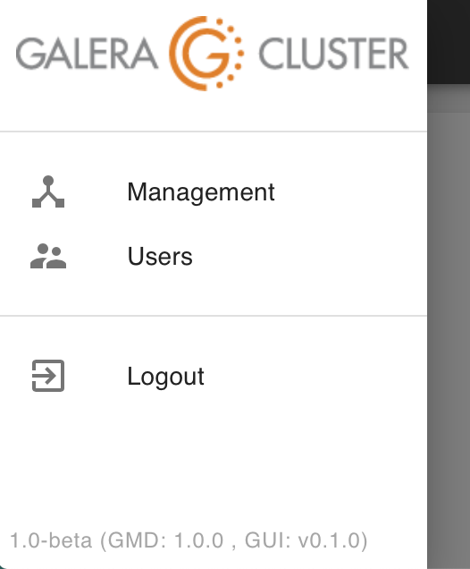

.. meta::
   :title: Upgrading Galera Manager
   :description:
   :language: en-US
   :keywords: galera cluster, gmd, galera manager, gui, installation, install
   :copyright: Codership Oy, 2014 - 2020. All Rights Reserved.

.. container:: left-margin

   .. container:: left-margin-top

      :doc:`The Library <../index>`

   .. container:: left-margin-content

      .. cssclass:: here

         - :doc:`Documentation <./index>`

      - :doc:`Knowledge Base <../kb/index>`
      - :doc:`Training <../training/index>`

      .. cssclass:: sub-links

         - :doc:`Tutorial Articles <../training/tutorials/index>`
         - :doc:`Training Videos <../training/videos/index>`

      - :doc:`FAQ <../faq>`

      Galera Manager Documents

      - :doc:`Getting Started <./galera-manager>`
      - :doc:`Installing <./gmd-install>`
      - :doc:`AWS Ports <./galera-manager-ports>`
      - :doc:`gmd Daemon <./gmd>`
      - :doc:`Deploying Clusters <./galera-manager-adding-clusters>`
      - :doc:`Adding Nodes <./galera-manager-adding-nodes>`
      - :doc:`Adding Users <./galera-manager-adding-users>`
      - :doc:`Loading Data <./galera-manager-initializing-data>`
      - :doc:`Monitoring a Cluster <./galera-manager-monitoring-clusters>`

      .. cssclass:: here

         - :doc:`Upgrading <./gmd-upgrading>`

.. container:: top-links

   - `Home <https://galeracluster.com>`_

   .. cssclass:: here

      - :doc:`Docs <./index>`

   - :doc:`KB <../kb/index>`

   .. cssclass:: nav-wider

      - :doc:`Training <../training/index>`

   - :doc:`FAQ <../faq>`

.. cssclass:: library-document
.. _`upgrading-gmd`:

===================================================
Upgrading Galera Manager (``gmd``)
===================================================

To use Galera Manager, you may install it on a local computer, but it's more typically installed on an AWS (Amazon Web Services) *Instance*.  Whatever you decide to use, you'll need to download the *Galera Manager Installer* to it.

.. _`gmd-version-release`:
.. rst-class:: section-heading
.. rubric:: Galera Manager Version

As new releases of Galera Manager software is released by Codership, you may update your installation using ``yum`` or ``apt-get``, depending on your distribution of Linux.  When you installed Galera Manager, a repository file will have been added to the repository directory:  ``galera.repo`` in ``/etc/yum.repos.d`` on servers using ``yum``; and ``galera-manager.list`` in ``/etc/apt/sources.list.d`` on  servers using ``apt-get``. These repository files will contain the address of the Codership repository, along with some related information.

To see which version and release of Galera Manager you're using, click on the menu icon, the three horizontal strips at the top left.  It will reveal what you see in the screenshot of Figure 1 below:

   Galera Manager Menu with Version and Release Number (Figure 1)

In this example screenshot, you can see in the subdued text at the bottom that this installation of Galera Manager is the beta version 1.0. The ``gmd`` is version 1.0.0, and the graphical user interface is version 0.1.0.  You don't need to keep track of those numbers, but when you read about a new Galera Manager feature offered in these documentation pages, but that you don't have in your installation, you can check your versions to see if maybe you need to upgrade Galera Manager.

.. _`gmd-updates`:
.. rst-class:: section-heading
.. rubric:: Updating Galera Manager

You wouldn't run the *Galera Manager Installer* again to upgrade |---| reinstalling is not permitted by the *Installer*. Nor would you uninstall Galera Manager and reinstall it |---| there's no easy way to uninstall.  Instead, you would use whatever package management utility (i.e., ``apt-get`` or ``yum``) you used when you first installed Galera Manager.

When running updates of your server, Galera Manager software will be included.  However, if you want to upgrade specifically the Galera Manager software, you can do so like this on a server using the ``yum`` package management utility:

.. code-block:: console
   :caption: Method to Upgrade Galera Manager with ``yum`` (Example 1)

   yum upgrade galera-manager

This will upgrade the Galera Manager software, but you might be asked to upgrade also any related libraries it uses. Unless there would be a problem with those upgrades for other software you're using on your server, cooperate with the requests to upgrade the other packages.

Here's how you would upgrade Galera Manager on a server using ``apt-get``:

.. code-block:: console
   :caption: Method to Upgrade Galera Manager with ``apt-get`` (Example 2)

   apt-get update
   apt-get --only-upgrade install galera-manager

You would do this only on the server running Galera Manager, not on the hosts used for the Galera Cluster nodes.

Once the upgrades are finished, ``gmd`` will be restarted automatically.  You might refresh your web browser, though, if you're logged into Galera Manager at the time.  All of your settings, as well as your cluster and nodes should remain |---| including the databases and their data.

.. container:: bottom-links

   Galera Manager Documents

   - :doc:`Getting Started <./galera-manager>`
   - :doc:`Installing <./gmd-install>`
   - :doc:`AWS Ports <./galera-manager-ports>`
   - :doc:`gmd Daemon <./gmd>`
   - :doc:`Deploying Clusters <./galera-manager-adding-clusters>`
   - :doc:`Adding Nodes <./galera-manager-adding-nodes>`
   - :doc:`Adding Users <./galera-manager-adding-users>`
   - :doc:`Loading Data <./galera-manager-initializing-data>`
   - :doc:`Monitoring a Cluster <./galera-manager-monitoring-clusters>`
   - :doc:`Upgrading <./gmd-upgrading>`

.. |---|   unicode:: U+2014 .. EM DASH
   :trim:
