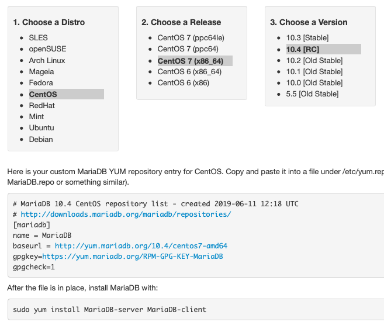

.. meta::
   :title: Install MariaDB Galera Cluster
   :description:
   :language: en-US
   :keywords: galera cluster, installation, install, mariadb, binaries, apt, yum
   :copyright: Codership Oy, 2014 - 2019. All Rights Reserved.

.. topic:: The Library
   :name: left-margin

   .. cssclass:: no-bull

      - :doc:`Documentation <./index>`
      - :doc:`Knowledge Base <../kb/index>`

      .. cssclass:: no-bull-sub

         - :doc:`Troubleshooting <../kb/trouble/index>`
         - :doc:`Best Practices <../kb/best/index>`

      - :doc:`FAQ <../faq>`
      - :doc:`Training <../training/index>`

      .. cssclass:: no-bull-sub

         - :doc:`Tutorial Articles <../training/tutorials/index>`
         - :doc:`Training Videos <../training/videos/index>`

      .. cssclass:: bull-head

         Related Documents

      - :doc:`Install Galera <./install>`
      - :doc:`MariaDB Galera Source <./install-mariadb-src>`
      - :doc:`Galera MySQL <./install-mysql>`

      .. cssclass:: bull-head

         Related Articles

      - :doc:`../training/tutorials/migration`

      .. cssclass:: bull-head

         Other Resources

      - :doc:`Galera AWS (video)  <../../training/videos/galera-aws-installing>`
      - :doc:`Galera MariaDB (video)  <../../training/videos/galera-mariadb-installing>`

.. cssclass:: library-document
.. _`install-mariadb-binary`:

============================================
MariaDB Galera Cluster - Binary Installation
============================================

MariaDB Galera Cluster is the MariaDB implementation of Galera Cluster.  Binary installation packages are available for Debian-based and RPM-based distributions of Linux through the MariaDB repository (`MariaDB Repository Generator <https://downloads.mariadb.org/mariadb/repositories/>`_).

.. _`mariadb-repo`:
.. rst-class:: rubric-1
.. rubric:: Enabling the MariaDB Repository

In order to install MariaDB Galera Cluster through your package manager, you need to enable the MariaDB repository on your server.  There are two different ways to accomplish this, depending on which Linux distribution you use.

.. _`mariadb-deb`:
.. rst-class:: rubric-2
.. rubric:: Enabling the ``apt`` Repository

For Debian and Debian-based Linux distributions, the procedure for adding a repository requires that you first install the software properties.  The package names vary depending on your distribution.  For Debian, at the command-line execute the following:

.. code-block:: console

   # apt-get install python-software-properties

For Ubuntu or a distribution derived from Ubuntu, execute instead this command:

.. code-block:: console

   $ sudo apt-get install software-properties-common

If you're use a different Debian-based distribution and neither of these lines above work, consult your distribution's package listings for the appropriate package name.

Once you have the software properties installed, you can enable the MariaDB repository for your server.

First, add the GnuPG key for the MariaDB repository by executing the following from the command-line:

.. code-block:: console

   # apt-key adv --recv-keys --keyserver \
         keyserver.ubuntu.com 0xcbcb082a1bb943db

Next, add the MariaDB repository to your sources list. You can do this by entering something like the following from the command-line:

.. code-block:: console

   # add-apt-repository 'deb https://mirror.jmu.edu/pub/mariadb/repo/version/distro release main'

You wouldn't enter exactly the line above. You'll have to adjust the repository address:

- ``version`` indicates the version number of MariaDB that you want to use. (e.g., ``5.6``).

- ``distro`` is the name of the Linux distribution you're using' (e.g., ``ubuntu``).

- ``release`` should be changed to your distribution release (e.g., ``wheezy``).

If you don't know which release is installed on your server, you can determine this by using the entering the following from the command-line:

.. code-block:: console

   $ lsb_release -a

#. You should also update the local cache on the server.  You can do this by entering the following:

.. code-block:: console

   # apt-get update

For more information on the MariaDB repository, package names and available mirrors, see the `MariaDB Repository Generator <https://downloads.mariadb.org/mariadb/repositories/>`_.

Packages in the MariaDB repository are now available for installation through ``apt-get``.

.. _`mariadb-rpm`:
.. rst-class:: rubric-2
.. rubric:: Enabling the ``yum`` Repository

For RPM-based distributions (e.g., CentOS, Red Hat and Fedora), you can enable the MariaDB repository by creating a text file with ``.repo`` as the file extension to the ``/etc/yum/repos.d/`` directory.

Using a simple text editor, create a new ``.repo`` file containing something like the following:

.. code-block:: ini

   # MariaDB.repo

   [mariadb]
   name = MariaDB
   baseurl = https://yum.mariadb.org/version/package
   gpgkey = httpss://yum.mariadb.org/RPM-GPG-KEY-MariaDB
   gpgcheck = 1

For the value of ``baseurl``, you'll have to adjust the web address:

- ``version`` should be changed to the version of MariaDB you want to use (e.g., ``5.6``).

- ``package`` will have to be changed to the package name for your operating system distribution, release and architecture.  For example, ``rhel6-amd64`` would reference packages for a Red Hat Enterprise Linux 6 server running on 64-bit hardware.

For more information on the repository, package names or available mirrors, see the `MariaDB Repository Generator <https://downloads.mariadb.org/mariadb/repositories/>`_. It will generate the actual text you will need to put in your repository configuration file. In fact, by clicking through the choices presented, you can just copy the results and paste them into your configuration file without any modification.

.. _`mariadb-install`:
.. rst-class:: rubric-1
.. rubric:: Installing MariaDB Galera Cluster

There are three packages involved in the installation of MariaDB Galera Cluster: the MariaDB database client, a command-line tool for accessing the database; the MariaDB database server, built to include the :term:`wsrep API` patch; and the :term:`Galera Replication Plugin`.

For Debian-based distributions, from the command-line run the following command:

.. code-block:: console

   # apt-get install mariadb-client \
         mariadb-galera-server \
	 galera

For RPM-based distributions, execute instead from the command line the following:

.. code-block:: console

   # yum install MariaDB-client \
         MariaDB-Galera-server \
	 galera

Once you've done this, MariaDB Galera Cluster will be installed on your server.  You'll need to repeat this process for each node in your cluster.

.. note:: If you installed MariaDB Galera Cluster over an existing stand-alone instance of MariaDB, there are some additional steps that you'll need to take to update your system to the new database server.  For more information on this, see :doc:`../training/tutorials/migration`.
