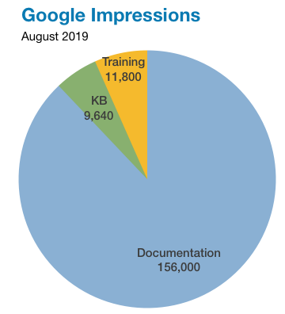
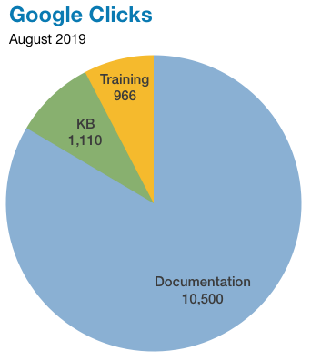

.. meta::
   :title: Codership Editors' Page
   :description:
   :language: en-US
   :keywords:
   :copyright: Codership Oy, 2014 - 2019. All Rights Reserved.

.. container:: left-margin

   .. container:: left-margin-top

      :doc:`The Library <../index>`

   .. container:: left-margin-content

      - :doc:`Documentation <../documentation/index>`
      - :doc:`Knowledge Base <../kb/index>`
      - :doc:`Training <../training/index>`

      .. cssclass:: sub-links

         - :doc:`Tutorial Articles <../training/tutorials/index>`
         - :doc:`Training Videos <../training/videos/index>`

.. container:: top-links

   - `Home <https://galeracluster.com>`_
   - :doc:`Docs <../documentation/index>`
   - :doc:`KB <./index>`

   .. cssclass:: nav-wider

      - :doc:`Training <../training/index>`

   - :doc:`FAQ <../faq>`

.. cssclass:: library-index
.. _`editors`:

=============================
Codership Writers & Editors
=============================

:doc:`The Codership Library <../index>` is written by the staff of Codership.  Its editors then edit and organize that text |---| some also write plenty of the text. This section of the Library relates to these activities.  Here you'll find information on how the Library is organized and our plans for its development and maintenance |---| assuming this is some of interest to anyone other than the editors.

.. rst-class:: section-heading
.. rubric:: :doc:`Mission & Goals <./mission-goals>`

The mission of the editorial staff, as well as their goals related to the Codership Library are described on this page |---| click on the title here to get to it. It includes a description and purpose of each section of the Library (e.g., the types of articles contained in the Knowledge Base).

.. rst-class:: section-heading
.. rubric:: Editorial Plans & Calendar

The Codership Library was reorganized recently to make it easier to find information on Galera Cluster. This includes the introduction of a knowledge base containing troubleshooting and best practices articles, as well as tutorial articles and training videos.

This has been quite an extensive project.  As such, we've added here plans of how we'll further organize and expand these primary sections of the Library, as well as an editorial calendar of the publication of articles and other resources.

On the right are two pie charts representing data from Google, depicting the percentage of user impressions and clicks for the Library. Below are brief summaries of each section of the Library and links to more detailed information.

.. rst-class:: rubric-2 list-sub-header
.. rubric:: :doc:`State of the Documentation <./docs-state>`

.. rst-class:: list-stats

   Content: 69 Documents, 242 Pages, 70,023 Words; Google Traffic, August: 156,000 Impressions, 10,500 Clicks

.. rst-class:: list-abstract sub-list-abstract

   Previously, the Documentation encompassed all of what is now known as the Library.  Now it's straightforward documentation, not tutorials or advice articles. It does include over two hundreds pages of information on configuring and administering Galera Cluster.

.. rst-class:: rubric-2 list-sub-header
.. rubric:: :doc:`Development of Knowledge Base <./kb-plans>`

.. rst-class:: list-stats

   Content: 21 Articles, 15 pages, 6,547 Words; Google Traffic, August: 9,640 Impressions, 1,110 Clicks

.. rst-class:: list-abstract sub-list-abstract

   The Knowledge Base provides troubleshooting articles about resolving common problems, and best practices articles for improving performance, ensuring against crashes, and other methods for getting the most out of Galera.

.. rst-class:: rubric-2 list-sub-header
.. rubric:: :doc:`Editorial Calendar for Tutorials <./tutorial-articles>`

.. rst-class:: list-stats

   Content: 22 Articles, 132 Pages, 59,430 Words; Google Traffic, August: 9,750 Impressions, 957 Clicks

.. rst-class:: list-abstract sub-list-abstract

   One of our goals is to write a robust set of tutorial articles to assist readers in learning about every aspect of Galera Cluster and related software.  On this page, you'll find a list of articles with links to them, as well as a list of articles we intend to add to the Library |---| along with when we expect to publish these articles.

.. rst-class:: rubric-2 list-sub-header
.. rubric:: :doc:`Plans for Training Videos <./training-videos>`

.. rst-class:: list-stats

   Videos: 10; Google Traffic, August: 2,090 Impressions, 8 Click

.. rst-class:: list-abstract sub-list-abstract

   Related to our tutorial articles, we have begun developing training videos, screencasts on how to use and configure Galera Cluster and related software. This page includes information on videos we've already created, as well as many additional videos we intend to create |---| and some videos we intend to eliminate.

.. rst-class:: rubric-2 list-sub-header
.. rubric:: :doc:`New Questions for the FAQ <./faqs-pending>`

.. rst-class:: list-stats

   Content: 35 Questions, 4,189 Words; Google Traffic, July: 991 Impressions, 97 Clicks

.. rst-class:: list-abstract sub-list-abstract

   On this page we record new questions for the FAQ until we are able to answer them properly.  Some contain rough answers; they're FAQs in progress.

.. rst-class:: section-heading
.. rubric:: Library Mechanics

Below are areas related to the mechanics of the Library: documentation processing system, mark-down language, as well as a style guide.

.. rst-class:: rubric-2 list-sub-header
.. rubric:: :doc:`Style Guide <./style-guide>`

.. rst-class:: list-abstract sub-list-abstract

   For a more profesional result, the editors of the Codership Library have developed a consistent style of writing text published in the Library. This is a style guide to help writers to create text for the Library.

.. rst-class:: rubric-2 list-sub-header
.. rubric:: :doc:`Sphinx & Restructured Text <./restructured-text>`

.. rst-class:: list-abstract sub-list-abstract

   Codership utilizes the Sphinx documentation system to organize and proces the documentation and other pages of the Library, including various articles. These documents or files are written in the Restructured Text format, a type of mark-down language.  This is a guide to that system and mark-down language.

.. rst-class:: rubric-2 list-sub-header
.. rubric:: :doc:`GitHub <./github-info>`

.. rst-class:: list-abstract sub-list-abstract

   All of the Codership Library files |---| the restructed text files, as well as the formatting and configuration files |---| are available publicly on GitHub. This page provides information about our GitHub repository.

.. toctree::
   :maxdepth: 2
   :hidden:

   docs-state
   faqs-pending
   github-info
   kb-plans
   mission-goals
   restructured-text
   style-guide
   tutorial-articles
   training-videos

.. |---|   unicode:: U+2014 .. EM DASH
   :trim:
