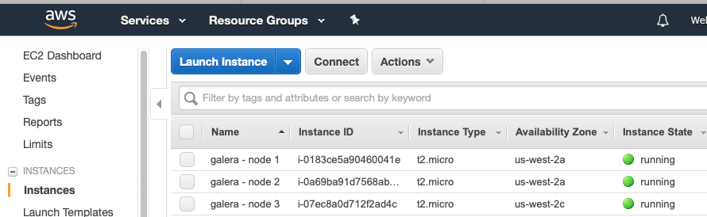
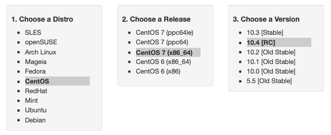
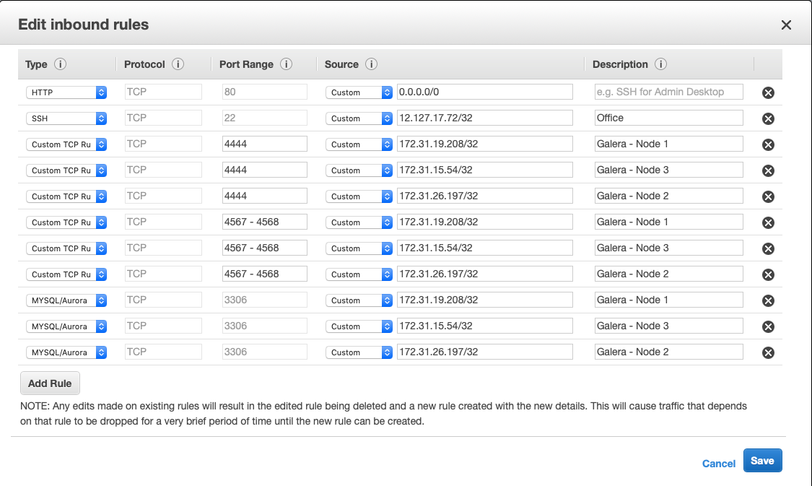

.. cssclass:: tutorial-article

===================================
Setting Up a Galera Cluster on AWS
===================================
.. _`aws-galera-cluster`:

.. rst-class:: list-stats

   Length: 2494 words; Writer: Russell J.T Dyer: June 15, 2019; Topic: Installation; Level: Intermediate

Amazon Web Services (AWS) is one of the largest providers of virtual servers and other web services. Through an account with AWS, using their EC2 (Elastic Compute Cloud) platform, you can create virtual servers, known as *instances*, and choose the operating system distribution. From there you can log remotely into the instance like you would a physical server, and install MySQL or MariaDB and Galera software. This means that you can create multiple instances to form a Galera Cluster.

This tutorial will explain the steps to creating instances on AWS, and how to install and configure the database and Galera software on each node. It'll end by showing you how to start the cluster.

We're assuming you already have an account with AWS and know the basics of how to use the EC2 platform to create an instance and related aspects. We'll focus instead on aspects relevant to forming a Galera Cluster.

.. rubric:: Encryption Key
   :class: list-sub-header

For this article, we'll create three nodes to be used in the cluster. To access these nodes, you'll need an encryption key. You can use an existing key, but we recommend creating a new one specifically for the Galera. There are many tools to do so, such as ``ssh-keygen``. See `Generating an SSH Key <https://help.github.com/en/articles/generating-a-new-ssh-key-and-adding-it-to-the-ssh-agent>`_ for instructions on how to do this.

Once you have your encryption key, log into AWS and navigate to the EC2 console. Under *Security* in the left margin, click on the *Key Pairs* link. Click on the white *Import Key Pair* button.  You can click on *Choose File* to load a ``.pem`` file from your computer, or you can copy and paste the raw text from your key into the large box labeled, *Public Key Contents*. Give the key a name like, *galera-cluster*.  When finished, click *Import*.

.. rubric:: Creating AWS Instances
   :class: list-sub-header

With an encryption key in place, you're ready to create three instances on AWS. You could create more, but we'll do three, which is the minimum recommended for a healthy cluster. In the EC2 console, click on *Instances* in the left margin. That will show your existing instances in the main pane. Now click on the large blue button at the top labeled, *Launch Instances*.

The first choice you'll have to make when creating a new instance is the operating system distribution. For the examples in this article, we chose *CentOS 7 (x86_64) - with Updates HVM*. This is a 64-bit operating system.

The second step is to choose an instance type. Because we're using this cluster as a training tool, we chose ``t2.micro`` since it's *Free Tier Eligible*.  This allows us to use it for a year without having to pay anything.

Next, you'll be asked configure the details of the instance. The first box asks how many instances you want to launch: enter 3. You can leave all of the other settings at their default values.

Adding storage is next. If you chose the free tier as did we, you'll have to accept the default of 8 gigabytes of storage. You may need more if you're creating a cluster for production use. For our training purposes, this is plenty. The next screen is about adding tags, you can click past that.

Then you'll be asked to configure a security group. This is basically AWS's firewall. Even if you already have one for your existing instances, create a new one just for Galera. Name it something easy like, *galera-servers*. You'll be able to give several inbound traffic rules related to the three nodes we'll create and the ports they will need. Until we create the three instances, though, we won't know their IP addresses. So, for now, just add a rule that allows you to log into the nodes. To do this, select SSH type. For the source, click on the pull-down menu and choose *My IP* |---| or choose *Custom* and type in the IP address from which you'll log in (e.g., ``12.127.17.72/32``).

With that all done, click on the blue button at the bottom right to review and launch the instance. It will show you the choices you made. If everything is fine, click *Launch*.

A dialog box will then appear asking you to provide an encryption key. Click *Choose an Existing Key Pair* and select the one you created for Galera. Then read and click the check-box for the warning and then click *Launch Instance*. That'll begin the process of starting the instance.

Now, click on the *Instances* link in the margin again to see state of the instances. It'll take a little while before the new instances are running. You may want to label each instance something like, *galera - node 1*.

.. rubric:: Installing Software on Nodes
   :class: list-sub-header

When all three nodes are running, you're ready to install and configure the database and Galera software. Check the details of each instance to get the external IP address. Then use ``ssh`` to log into each node, using your the encryption key.

It's best to keep all three nodes the same. So update the software that's already installed on each node with a command-line package-management utility. Since we installed CentOS on our nodes, we used ``yum`` on each like so:

.. code-block:: console

   sudo yum -y update

We also installed ``rsync``, which Galera will use to synchronize nodes when they first join the cluster, or recovering nodes that have been offline for a while. We also installed ``firewalld``, which provides a firewall.

.. code-block:: console

   sudo yum -y install rync firewalld

When you've finished updating and installing basic software on all three nodes, you can then proceed to installing the database and Galera software. For our purposes, we chose to install MariaDB. If you'd prefer to use MySQL, see the article on :doc:`Installing MySQL and Galera Cluster <../../documentation/install-mysql>`.

To install MariaDB, we first used the MariaDB repository (`MariaDB Repository Generator <https://downloads.mariadb.org/mariadb/repositories/>`_).  We chose the CentOS distribution, the CentOS 7 (x86_64) release to match what we've installed on our nodes. We then chose the MariaDB version 10.4. The repository tool gave us the lines we needed to copy into a new repo file, ``/etc/yum.repos.d/mariadb.repo``.

Using ``yum`` again, we executed the following from the command-line on each node:

.. code-block:: console

   sudo yum install MariaDB-server MariaDB-client

That will install everything we need, including the Galera software since it's shipped with MariaDB as of version 10.4. When you're finished doing this one each node, you'll be ready to configure the MariaDB and Galera.

.. rubric:: Configuring Software on Nodes
   :class: list-sub-header

Before starting MariaDB on each node, you need to configure it. To do this, edit the ``my.cnf`` file |---| or ``/etc/my.cnf.d/server.cnf`` as we did. Add the following lines under the ``[mysqld]`` heading:

.. code-block:: ini

   [mysqld]
   datadir=/var/lib/mysql
   socket=/var/lib/mysql/mysql.sock
   bind-address=0.0.0.0
   user=mysql

   default_storage_engine=InnoDB
   innodb_autoinc_lock_mode=2
   innodb_flush_log_at_trx_commit=0
   innodb_buffer_pool_size=128M

   binlog_format=ROW
   log-error=/var/log/mysqld.log

There are some basic parameters related to MariaDB and using the InnoDB storage engine |---| which is the only one that Galera uses. For parameters particular to Galera, add a ``[galera]`` section to the same configuration file:

.. code-block:: ini

   [galera]
   wsrep_on=ON
   wsrep_provider=/usr/lib64/galera-4/libgalera_smm.so

   wsrep_node_name='galera1'
   wsrep_node_address="172.31.19.208"
   wsrep_cluster_name='galera-training'
   wsrep_cluster_address="gcomm://172.31.19.208,172.31.26.197,172.31.15.54"

   wsrep_provider_options="gcache.size=300M; gcache.page_size=300M"
   wsrep_slave_threads=4
   wsrep_sst_method=rsync

There are several parameters here, but we'll talk about just a few of them. First, ``wsrep_on`` enables Galera. The file path for the value of ``wsrep_provider`` may have to be adjusted to your server.

The ``wsrep_node_name`` needs to be unique for each node (e.g., ``galera1``, ``galera2``, and ``galera3``). The ``wsrep_node_address`` is the IP address for the node. For AWS, use the internal IP addresses, not the external ones. You'll have to adjust this for each node. Make sure the ``wsrep_node_name`` and the ``wsrep_node_address`` correspond to the names you gave for each node in AWS. It will make it easier later to shut down a node for maintenance.

The ``wsrep_cluster_name`` is a name you'll assign for the cluster. It has to be the same on all three nodes. The ``wsrep_cluster_address`` contains the IP addresses of all of the nodes in the cluster, including the node on which it's entered.

That's all that we need to do to configure MariaDB and Galera. However, don't start MariaDB, yet. You first need to configure security on each node and on AWS.

.. rubric:: Security Settings on Nodes
   :class: list-sub-header

Security is important, but it can be the biggest obstacle for creating a new Galera Cluster. You have to open the lines of communications between the nodes. The two main factors will be SELinux and the firewall. You could disable both, but we recommend using them and enabling what you need.

Galera Cluster uses a few TCP ports: 3306 (MariaDB's default), 4444, 4567, and 4568 |---| and 4567 for UDP.  For SELinux, you will need to open these ports by executing the following from the command-line on each node:

.. code-block:: console

   semanage port -a -t mysqld_port_t -p tcp 3306
   semanage port -a -t mysqld_port_t -p tcp 4444
   semanage port -a -t mysqld_port_t -p tcp 4567
   semanage port -a -t mysqld_port_t -p udp 4567
   semanage port -a -t mysqld_port_t -p tcp 4568
   semanage permissive -a mysqld_t

As for the firewall, you'll have to first enable and start it by entering the first two lines below. The six lines that follow those two will open the needed ports. The last line reloads the ``firewalld`` daemon.

.. code-block:: console

   systemctl enable firewalld
   systemctl start firewalld

   firewall-cmd --zone=public --add-service=mysql --permanent
   firewall-cmd --zone=public --add-port=3306/tcp --permanent
   firewall-cmd --zone=public --add-port=4444/tcp --permanent
   firewall-cmd --zone=public --add-port=4567/tcp --permanent
   firewall-cmd --zone=public --add-port=4567/udp --permanent
   firewall-cmd --zone=public --add-port=4568/tcp --permanent
   firewall-cmd --reload

After these lines have been executed on each node, they're now ready to interact with each other. You just need to go back to AWS and add some entries to the security group you created earlier so that AWS would interfere.

.. rubric:: Security Settings on AWS
   :class: list-sub-header

From the AWS EC2 console, under *Security* in the left margin, click on *Security Groups* and then select the one you created for your Galera cluster. Under the *Actions* pull-down menu, select *Edit Inbound Rules*. This will open a large dialog box like the one in the screenshot below.

For your first entry, click *Add Rule* and select the type, *MySQL/Aurora* and then enter the internal IP address for the first node (e.g., ``172.31.19.208/32``). Add a description to keep your sanity (e.g., *Galera - Node 1*). Next, add another rule, but this time select the type, *Custom TCP Rule*. Enter in the port field, ``4444``. Then enter the internal IP address and a description of the first node. Now add another custom TCP entry the same way, but for the port, enter ``4567 - 4568``. Last, add a custom UDP entry for port ``4567``.

Repeat these four entries for each node, adjusting the IP addresses and descriptions for each.  When you're finished, click on *Save*.

Now that you've authorized each Galera node to communicate with the others on the required ports, you're ready to start Galera

.. rubric:: Starting Galera
   :class: list-sub-header

When first starting a new Galera cluster, you'll have to start one node first. The problem is that if there are no other nodes in the cluster, it will fail |---| unless you start MariaDB on the first node telling it that it's the first. To do this, you would use the ``--wsrep-new-cluster`` option.

To make it easy, though, in version 4 of Galera, you can use the ``galera_new_cluster`` script. Just execute it from the command-line on the first node, only. Incidentally, if you ever shut-down all nodes in the cluster and want to use ``galera_new_cluster`` again, you may have to edit ``/var/lib/mysql/grastate.dat`` and change the ``safe_to_bootstrap`` variable in that file from 0 to 1.

Running ``galera_new_cluster`` on the first node will start MariaDB and Galera, but only on that one node. On the other nodes, execute the following from the command-line:

.. code-block:: console

   systemctl start mariadb

Wait until the second node has started before starting the third. It doesn't matter, but it's better to keep the clutter to a minimum when learning. Once MariaDB has started on each node, enter the first line below from the command-line on one of the nodes. Incidentally, there's no password at this point, so just hit enter when asked.

.. code-block:: console

   mysql -p -u root -e "SHOW STATUS LIKE 'wsrep_cluster_size'"

   Enter password:

   +--------------------+-------+
   | Variable_name      | Value |
   +--------------------+-------+
   | wsrep_cluster_size | 3     |
   +--------------------+-------+

You can see from the results here that there are three nodes in the cluster. That's what we want. You've successfully installed a Galera cluster using AWS instances. You can start entering data and using the cluster.

If you first want to play with the cluster a bit, log into all three nodes with the ``mysql`` client. Create a database on one node and check the other two nodes to see that it's there. Then create a table on another node and insert a row of data into that table on the third node. Then execute a ``SELECT`` statement on each node to see that it's replicating the data across the cluster.

.. |---|   unicode:: U+2014 .. EM DASH
   :trim:
