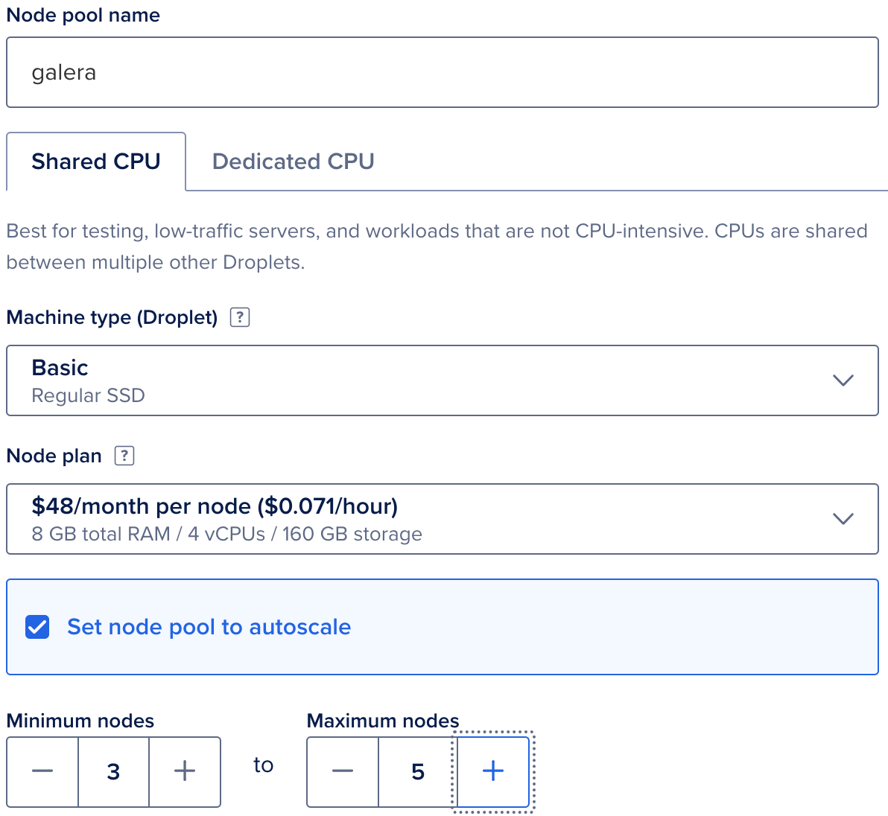
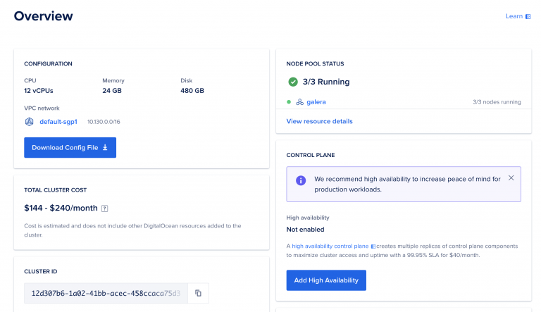
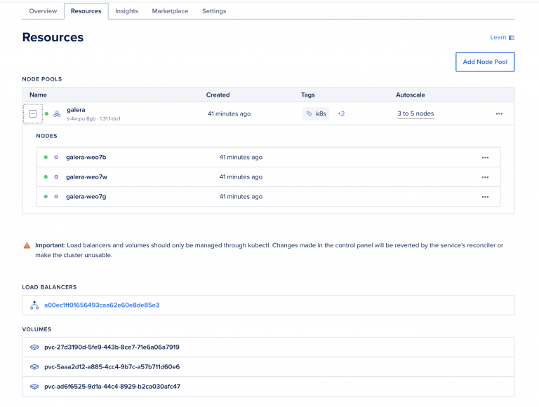
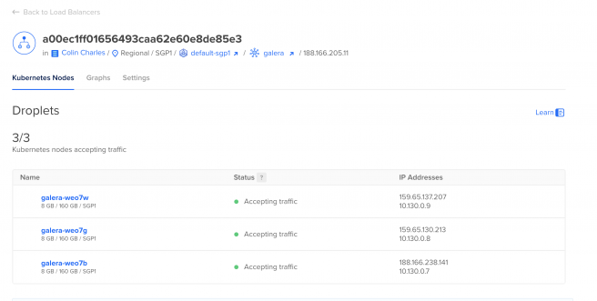

.. meta::
   :title: Getting Started Galera with Kubernetes
   :description:
   :language: en-US
   :keywords:
   :copyright: Codership Oy, 2014 - 2024. All Rights Reserved.

.. container:: left-margin

   .. container:: left-margin-top

      :doc:`The Library <../../index>`

   .. container:: left-margin-content

      - :doc:`Documentation <../../documentation/index>`
      - :doc:`Knowledge Base <../../kb/index>`
      - :doc:`Training <../index>`

      .. cssclass:: sub-links

         - :doc:`Training Courses <../courses/index>`
         - :doc:`Training Videos <../videos/index>`

      .. cssclass:: sub-links

         .. cssclass:: here

         - :doc:`Tutorial Articles <./index>`

      - :doc:`FAQ <../../faq>`
      - :ref:`search`

.. container:: top-links

   - `Home <https://galeracluster.com>`_
   - :doc:`Docs <../../documentation/index>`
   - :doc:`KB <../../kb/index>`

   .. cssclass:: here nav-wider

      - :doc:`Training <../index>`

   - :doc:`FAQ <../../faq>`

.. cssclass:: library-article
.. _`getting-started-kubernetes`:

=======================================
Getting Started Galera with Kubernetes
=======================================

.. rst-class:: article-stats

   Length: 848 words; Published: October 22, 2024; Topic: Container; Level: Intermediate

`Kubernetes <https://kubernetes.io/>`_ is an open source system for automating deployment, scaling, and management of containerized applications. In addition, `Helm Charts <https://helm.sh/>`_ help you define, install, and upgrade Kubernetes applications.

In this tutorial, we will use the example of setting it up at `DigitalOcean <https://www.digitalocean.com/>`_, but the setup is similar, whether you do this in a Kubernetes on-premises deployment or if you do it on another cloud provider (such as `Amazon Elastic Kubernetes Service <https://aws.amazon.com/eks/>`_ or `Google Kubernetes Engine <https://cloud.google.com/kubernetes-engine/?hl=en>`_).

Before you start, have a Linux computer to handle the management and connectivity to your Kubernetes cluster. In this example, we use Ubuntu 24.04 LTS. 

.. rst-class:: section-heading
.. rubric:: Install Kubernetes and Helm Charts

On your Linux computer, run the commands below:

.. code-block:: console

   snap install kubectl --classic
   snap install helm --classic

.. rst-class:: section-heading
.. rubric:: Create a Kubernetes Cluster

In the DigitalOcean control panel, launch a 3-node Kubernetes cluster. Use an 8 GB instance, to reserve at least 4 GB for MySQL. 

   *DigitalOcean Control Panel*

Once setup, download the configuration file by selecting **Overview** | **Download Config File**.

   *Download Config File*

Create a directory for the configuration file:

.. code-block:: console

   mkdir ~/kube
   cp galera-kubeconfig.yaml ~/kube/config
   chmod 0600 ~/kube/config

Verify the connection by listing the nodes in your cluster. The output looks like this:

.. code-block:: console

   mkdir ~/kube

   root@kube:~# kubectl get nodes
   NAME           STATUS   ROLES    AGE     VERSION
   galera-weo7b   Ready    <none>   6m29s   v1.31.1
   galera-weo7g   Ready    <none>   6m41s   v1.31.1
   galera-weo7w   Ready    <none>   6m48s   v1.31.1 

You can see the same nodes in DigitalOcean by selecting the **Resources** tab:

   *Resources*

.. rst-class:: section-heading
.. rubric:: Deploy Helm Charts

Get the `Galera Helm chart <https://github.com/codership/containers/releases/download/8.0.39/mysql-galera-8.0.39-1.tar.gz>`_ and get ready to deploy it:

.. code-block:: console

   wget https://github.com/codership/containers/releases/download/8.0.39/mysql-galera-8.0.39-1.tar.gz
   tar -zxvpf mysql-galera-8.0.39-1.tar.gz
   cd mysql-galera-8.0.39-1
   root@kube:~/mysql-galera-8.0.39-1# kubectl create namespace galera
   
   namespace/galera created
   root@kube:~/mysql-galera-8.0.39-1# helm install galera-release . -n galera
   NAME: galera-release
   LAST DEPLOYED: Fri Oct  4 00:48:03 2024
   NAMESPACE: galera
   STATUS: deployed
   REVISION: 1
   NOTES:
   NOTE: It may take a few minutes for the LoadBalancer IP to be available.

Before you deploy the Galera Helm chart, you can also edit ``values.yaml`` to at least change the ``rootpw`` password:

.. code-block:: console

   mysql:
     rootpw: "@@SET_ME@@" # will be used only in the case of database initialization
     user:
       name: "@@SET_ME@@" # this account will be used for read-only liveness checks
       passwd: "@@SET_ME@@" # and a password for that account

If you do not change the ``rootpw`` password, your default root password will be ``@@SET_ME@@``.

Wait for the pods to be ready:

.. code-block:: console

   kubectl get pods -n galera -w
   
   
   NAME                            READY   STATUS            RESTARTS   AGE
   galera-release-mysql-galera-0   0/1     PodInitializing   0          19s
   galera-release-mysql-galera-1   0/1     PodInitializing   0          19s
   galera-release-mysql-galera-2   0/1     PodInitializing   0          19s
   galera-release-mysql-galera-1   0/1     Running           0          31s
   galera-release-mysql-galera-2   0/1     Running           0          35s
   galera-release-mysql-galera-0   0/1     Running           0          37s
   galera-release-mysql-galera-0   1/1     Running           0          62s
   galera-release-mysql-galera-1   1/1     Running           0          83s
   galera-release-mysql-galera-2   1/1     Running           0          91s

Check the status of pods in the Galera Cluster:

.. code-block:: console

   kubectl get pods -n galera
   NAME                            READY   STATUS    RESTARTS   AGE
   galera-release-mysql-galera-0   1/1     Running   0          2m46s
   galera-release-mysql-galera-1   1/1     Running   0          2m46s
   galera-release-mysql-galera-2   1/1     Running   0          2m46s

Now you can get the status of the Galera Cluster by executing:

.. code-block:: console

   kubectl exec -it galera-release-mysql-galera-0 -n galera -- mysql -uroot -p$(kubectl get secret --namespace galera galera-release-mysql-galera -o jsonpath="{.data.mysql-root-password}" | base64 --decode) -e "SHOW STATUS LIKE 'wsrep_cluster_size';"
   Enter password: 
   +--------------------+-------+
   | Variable_name      | Value |
   +--------------------+-------+
   | wsrep_cluster_size | 3     |
   +--------------------+-------+

.. note::

  Replace ``galera-release-mysql-galera-0`` with whatever podname you have created.

If you want to login directly, you also also just do:

.. code-block:: console

   kubectl exec -it galera-release-mysql-galera-1 -n galera -- /bin/bash
   mysql -uroot -p

This will give you access to the MySQL instance running in the pod: ``galera-release-mysql-galera-1``.

.. rst-class:: section-heading
.. rubric:: Deploy DigitalOcean Load Balancer

Use the load balancer provided by DigitalOcean, as you have one IP address to connect to, and it will balance between the three Galera Clusters on the backend (and in this particular example setup, we did say that the backends can grow till five nodes). You can get the IP address from the DigitalOcean GUI:

   *Kubernetes Nodes*

However, you can also see them from the command line:

.. code-block:: console

   kubectl get services -n galera
   
   NAME                                 TYPE           CLUSTER-IP      EXTERNAL-IP      PORT(S)                      AGE
   galera-release-mysql-galera          ClusterIP      None            <none>           4567/TCP,4568/TCP,4444/TCP   11m
   galera-release-mysql-galera-client   LoadBalancer   10.245.90.155   188.166.205.11   3306:30006/TCP               11m 

As you can see, the load balancer IP in this example is 188.166.205.11. Next, connect to it:

.. code-block:: console

   mysql -h 188.166.205.11 -uroot -p

See which node you end up getting (this can vary). Upon a few runs, here is an extract of what you may see:

.. code-block:: console

   mysql> select @@server_uuid,@@server_id,@@hostname\G
   *************************** 1. row ***************************
   @@server_uuid: 759c7a51-81ea-11ef-9b0f-9e9aad10fd60
     @@server_id: 1
      @@hostname: galera-release-mysql-galera-1
   1 row in set (0.00 sec)
   
   mysql> SHOW VARIABLES LIKE 'wsrep_node_name';
   +-----------------+-------------------------------+
   | Variable_name   | Value                         |
   +-----------------+-------------------------------+
   | wsrep_node_name | galera-release-mysql-galera-1 |
   +-----------------+-------------------------------+
   1 row in set (0.00 sec)
   
   mysql> select @@server_uuid,@@server_id,@@hostname\G
   *************************** 1. row ***************************
   @@server_uuid: 6694e6f5-81ea-11ef-9303-e2481ce35a66
     @@server_id: 1
      @@hostname: galera-release-mysql-galera-0
   1 row in set (0.01 sec)
   
   mysql> SHOW VARIABLES LIKE 'wsrep_node_name';
   +-----------------+-------------------------------+
   | Variable_name   | Value                         |
   +-----------------+-------------------------------+
   | wsrep_node_name | galera-release-mysql-galera-0 |
   +-----------------+-------------------------------+
   1 row in set (0.02 sec)

An example of connecting to 2 pods is above: ``galera-release-mysql-galera-1`` and ``galera-release-mysql-galera-0``.

.. rst-class:: section-heading
.. rubric:: Summary

Now you have a three-node Galera Cluster running in a three-node Kubernetes deployment. 

.. |---|   unicode:: U+2014 .. EM DASH
   :trim:
